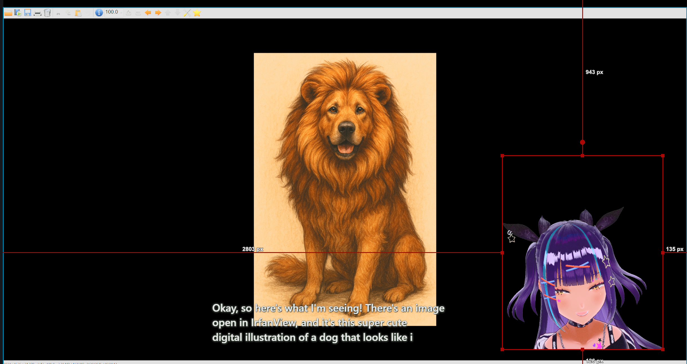
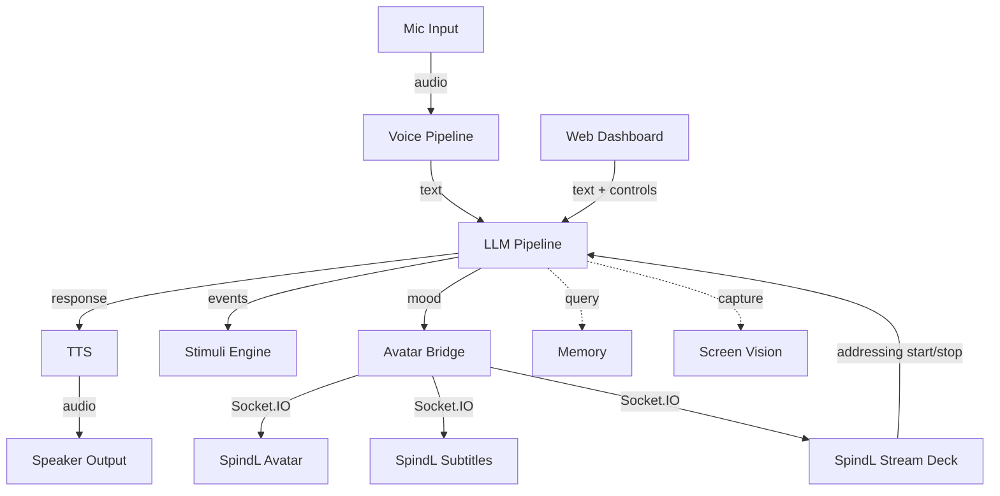

# SpindL

A local-first AI character engine. Give your character a voice, a face, memory, and screen vision; all running on your hardware. Stream them on Twitch with OBS, or just talk. Technically speaking, it can run in your machine, otherwise this app provides cloud provider options (OpenRouter mostly).

  

DEMO VIDEO: [Youtube](https://www.youtube.com/watch?v=WwQ7wQR-7rw)


## What It Does

You talk, it listens, it talks back. The whole voice loop runs locally — mic → VAD → STT → LLM → TTS → speaker. It's real-time, streaming, and you can interrupt it mid-sentence.

- **Character Cards** — [SillyTavern V2](https://github.com/SillyTavern/SillyTavern) compatible. Import PNG cards straight from Chub or SillyTavern (avatar + lorebook included), export your characters as Tavern Cards, or make your own from scratch.
- **Memory** — ChromaDB vector store with RAG across three tiers: global (cross-character, user-curated), per-character general (durable facts), and per-session (auto-generated reflection flash cards and summaries). Retrieval uses composite scoring — relevance, recency decay, importance rating, and access frequency — with configurable weights and tier multipliers. Reflection prompts are fully user-editable.
- **Screen Vision** — Takes screenshots and describes them via VLM. Can run as a dedicated local server, a cloud API, or piggyback on your main LLM if it supports vision, so far I only tested with Gemma3 models for local multi-modal vision. Note: The image is based on what is viewable in your main display.

  

- **Avatar** — Standalone Tauri 2 + Three.js desktop overlay. Loads VRM models, does lipsync, tracks your cursor, and reacts with facial expressions and body animations based on what it's saying. Emotion classifier picks the mood, which drives both per-character expression composites (custom blend shape recipes) and base animation slots (idle, happy, sad, angry, curious) using Mixamo FBX clips retargeted to VRM skeletons. Assign different VRM models and animation sets per character.
- **Stream Subtitles** — Separate Tauri 2 window for OBS compositing. Typewriter text synced to TTS duration, chroma key backgrounds, configurable fade. Just window-capture it in OBS.
- **Stimuli** — The character doesn't just wait for you. It'll start talking on its own if you go idle, and it reads Twitch chat. You can write your own stimulus modules too.
- **Stream Deck** — Standalone Tauri 2 overlay with hold-to-activate buttons. Signal when you're talking to chat, mods, Discord, or someone in the room — the character suppresses responses while held and gets context-aware prompting on release. Multiple named contexts, each with its own button and custom prompt. Dynamic add/remove from the dashboard.
- **Prompt Workshop** — Block-based prompt editor. See exactly how many tokens each section costs, reorder them, override individual blocks with your own text, wrap them with injection prefixes/suffixes.
- **Generation Control** — Temperature, top-p, max tokens, repeat penalty, repeat window, frequency penalty, and presence penalty — all adjustable from the dashboard mid-conversation. Values persist across restarts.
- **Runtime Swapping** — Switch LLM or VLM providers mid-conversation from the dashboard. No restart needed.
- **Chat Interface** — Text and voice in one view. Message history persists across sessions.
- **Web Dashboard** — Next.js control panel. Character portrait with audio-reactive glow, real-time pipeline status, config, prompt editing, memory curation, session browser.

## Architecture



One launcher script starts everything. One config file controls it all.

## Requirements

**Hardware:**
- NVIDIA GPU with at least 12GB VRAM (LLM + TTS + STT need to fit somewhere)
- More VRAM = bigger models. Two GPUs is nice if you have them

**Developed on:**
- CPU: Intel Core i9-13900K
- RAM: 64GB DDR5
- GPU: NVIDIA RTX 4090 (24GB) + RTX 3090 (24GB)
- OS: Windows 11, Python 3.12, CUDA 12.x

**Software:**
- Python 3.10+
- Node.js 20.9+ (for the web dashboard — required by Next.js 16)
- [llama.cpp](https://github.com/ggerganov/llama.cpp) (pre-built binary or build from source)
- A GGUF model file (Qwen3, Llama 3, etc.)

**Optional:**
- [Rust](https://rustup.rs/) 1.75+ (required for SpindL Avatar, SpindL Subtitles, and SpindL Stream Deck — Tauri 2 apps. First-time build via Install button in Settings, ~6.5GB disk for shared Cargo workspace)
- A VLM-capable model (Gemma 3, LLaVA, etc.) or cloud VLM API key
- An embedding model (for memory/RAG — e.g., nomic-embed-text-v1.5)

## Installation

### Backend

```bash
# Clone the repository
git clone https://github.com/YOUR_USERNAME/spindl.git
cd spindl

# Create a virtual environment (conda or venv)
conda create -n spindl python=3.12
conda activate spindl

# Install dependencies
pip install -e ".[dev]"
```

### Frontend (Web Dashboard)

```bash
cd gui
npm install
```

### Configuration

```bash
# Copy the example config
cp config/spindl.yaml.example config/spindl.yaml

# Copy the example .env for API keys (if using cloud providers)
cp .env.example .env
```

Edit `config/spindl.yaml` to point to your model files, set ports, and pick your providers. API keys go in `.env`, not the YAML (use `${ENV_VAR}` syntax).

Or skip the YAML entirely — launch the dashboard and configure everything from the Launcher page.

## Quick Start

```bash
python scripts/dev.py
```

Open `http://localhost:3000` → use the Launcher page to configure and start services. Ctrl+C gracefully terminates everything.

For headless mode, avatar setup, subtitles, tests, and more — see the [Usage Guide](docs/USAGE.md).


## Project Structure

```
spindl/
├── src/spindl/               # Backend (Python, ~34,400 lines, 135 files)
│   ├── audio/                #   Mic capture, speaker playback, Silero VAD
│   ├── avatar/               #   Emotion classifier (DistilBERT/ONNX), tool mood mapping
│   ├── characters/           #   SillyTavern V2 card models, import/export
│   ├── codex/                #   Lorebook activation & management
│   ├── config/               #   YAML config loading, env var resolution
│   ├── core/                 #   State machine, event bus, context manager
│   ├── gui/                  #   Socket.IO server, response models (Pydantic)
│   ├── history/              #   JSONL conversation persistence, prompt snapshots
│   ├── launcher/             #   Service process management & health checks
│   ├── llm/                  #   Prompt building, LLM providers, plugin pipeline
│   │   ├── builtin/          #     llama.cpp, DeepSeek, OpenRouter providers
│   │   ├── providers/        #     Pipeline content providers (history, persona, etc.)
│   │   └── plugins/          #     History, budget, codex, reasoning, TTS cleanup (dual-output)
│   ├── memory/               #   ChromaDB store, RAG injector, reflection, summaries
│   ├── orchestrator/         #   Central voice agent loop, config (Pydantic v2)
│   ├── stimuli/              #   Autonomous behavior engine (idle timer, Twitch chat, custom modules)
│   ├── stt/                  #   Speech-to-text providers (Whisper, Parakeet)
│   ├── tools/                #   Function calling framework (screen vision, etc.)
│   ├── tts/                  #   Text-to-speech providers (Kokoro, extensible)
│   ├── utils/                #   Shared utilities
│   ├── vision/               #   Screen capture + VLM providers (local, cloud, unified)
│   └── vts/                  #   VTubeStudio WebSocket driver
├── gui/                      # Frontend (Next.js + React + TypeScript, ~32,800 lines, 157 files)
│   └── src/
│       ├── app/              #   9 pages (dashboard, launcher, characters, settings, etc.)
│       ├── components/       #   100+ feature components + Radix UI design system
│       └── lib/              #   11 Zustand stores, Socket.IO client, Zod schemas
├── spindl-avatar/            # Standalone avatar renderer (Tauri 2 + Three.js + VRM)
├── spindl-subtitles/         # Stream subtitle overlay (Tauri 2, OBS-compositable)
├── spindl-stream-deck/       # Addressing-others button overlay (Tauri 2, hold-to-activate)
├── Cargo.toml                # Workspace root — shared target/ across all Tauri apps
├── tests/                    # 116 unit test modules (~29,000 lines)
├── tests_e2e/                # 8 E2E test modules (Playwright, 5-config matrix)
├── scripts/                  # Launcher, migration, standalone GUI
├── config/                   # spindl.yaml.example template
├── characters/               # User character cards (gitignored)
├── stt/server/               # External STT server scripts (NeMo Parakeet)
└── tts/server/               # External TTS server scripts
```

## Design Philosophy

- **Local-first.** Everything runs on your machine. Cloud providers are optional if you want them.
- **One config file.** `spindl.yaml` controls the whole system. `${ENV_VAR}` syntax keeps secrets out of version control.
- **Pluggable.** Every backend (LLM, STT, TTS, VLM) uses a registry. Adding a new provider = implement an ABC, register it, done.
- **Hot-swappable.** Switch LLM/VLM providers mid-conversation from the dashboard. No restarts.
- **SillyTavern compatible.** V2 character cards with PNG import/export. Drag a card from Chub into the import dialog and it just works — avatar, lorebook, and all.
- **Validated.** Pydantic v2 on the backend, Zod on the frontend. Config gets validated before it touches disk.

## Supported Providers

| Component | Local | Cloud |
|-----------|-------|-------|
| **LLM** | llama.cpp (any GGUF model) | DeepSeek, OpenRouter (200+ models) |
| **TTS** | Kokoro | — |
| **STT** | Whisper, Parakeet | — |
| **VLM** | llama.cpp (Gemma 3, LLaVA, etc.) or unified mode (LLM handles vision) | Any OpenAI-compatible API (xAI, OpenAI, etc.) or unified mode (multimodal cloud LLM) |
| **Embeddings** | llama.cpp (`--embedding` mode) | — |

Want to add a provider? Implement the ABC, register it, and you're good.

## Acknowledgments

- [kimjammer/Neuro](https://github.com/kimjammer/Neuro) — The project that proved a local Neuro-Sama was possible on consumer hardware. SpindL's stimuli system and overall architecture were heavily informed by studying this codebase.
- [Klaa/V1R4](https://github.com/Kunnatam/V1R4) — Tauri + Three.js + VRM avatar with lipsync and mood expressions. Studied as a reference implementation for SpindL's standalone avatar renderer.
- [SillyTavern](https://github.com/SillyTavern/SillyTavern) — Character card V2 specification.
- [ggerganov/llama.cpp](https://github.com/ggerganov/llama.cpp) — The LLM inference engine that makes local models practical.
- [VRoid Hub](https://hub.vroid.com/) — AvatarSample_B bundled as the default VRM model (redistribution permitted, no attribution required).

## License

[MIT](LICENSE) — Copyright 2026 jubbydubby
