<p align="center">
  
</p>

<h1 align="center">Usage Guide</h1>

SpindL is still in active development — things move fast and features get added regularly. This guide covers the current state of the application: how to set it up, how to configure each component, and how to use the features once everything's running. If something doesn't match what you're seeing, it's probably changed since this was last updated. Pull requests and issues are welcome.

Thanks for reading, and thanks for giving SpindL a shot.

---

## Table of Contents

- [Running](#running)
  - [Development Server](#development-server-recommended)
  - [Headless Launcher](#headless-launcher-no-gui----completely-experimental-not-really-recommended)
  - [Running Tests](#running-tests)
- [Launcher (Local LLM)](#launcher-local-llm)
  - [Getting llama.cpp](#getting-llamacpp)
  - [LLM Configuration](#llm-configuration)
  - [Vision Configuration](#vision-configuration-optional)
- [Launcher (Cloud LLM)](#launcher-cloud-llm)
  - [Cloud LLM Configuration](#cloud-llm-configuration)
  - [Cloud Vision Configuration](#cloud-vision-configuration-optional)
  - [STT Configuration](#stt-configuration)
  - [TTS Configuration](#tts-configuration)
  - [Embedding Server (Memory)](#embedding-server-memory)
- [Dashboard](#dashboard)
  - [Status Bar](#status-bar)
  - [Runtime LLM Provider](#runtime-llm-provider)
  - [Generation Parameters](#generation-parameters)
  - [Tool Use](#tool-use)
  - [Runtime VLM Provider](#runtime-vlm-provider)
  - [Stimuli System](#stimuli-system)
  - [Twitch Integration](#twitch-integration)
  - [Addressing Others](#addressing-others)
- [Sessions](#sessions)
  - [Session Transcript](#session-transcript)
  - [Session Memories](#session-memories)
- [Characters](#characters)
  - [Importing Characters](#importing-characters)
  - [Character Editor](#character-editor)
  - [Exporting Characters](#exporting-characters)
- [Prompt Workshop](#prompt-workshop)
- [Codex](#codex)
  - [Basic](#basic)
  - [Keywords](#keywords)
  - [Timing](#timing)
  - [Advanced](#advanced)
- [Memories](#memories)
  - [Memory Settings](#memory-settings)
  - [Reflection Prompt](#reflection-prompt)
  - [How Retrieval Works](#how-retrieval-works)
- [Avatar (Optional)](#avatar-optional)
  - [First-Time Install](#first-time-install)
  - [Per-Character Avatar & Animations](#per-character-avatar--animations)
  - [Base Animations](#base-animations)
  - [Avatar Settings](#avatar-settings)
- [Emotion Classifier (Optional)](#emotion-classifier-optional)
- [Stream Subtitles (Optional)](#stream-subtitles-optional)
- [Stream Deck (Optional)](#stream-deck-optional)

---

## Running

### Development Server (Recommended)

```bash
# Start backend + frontend in one command
python scripts/dev.py

# Custom backend port or config path
python scripts/dev.py --port 8765 --config spindl.yaml
```

Open `http://localhost:3000` → use the Launcher page to configure and start services through the GUI. No manual YAML editing required. Ctrl+C gracefully terminates all processes (backend, frontend, LLM servers, STT, TTS, avatar, subtitles). The dashboard's Shutdown button does the same.

### Headless Launcher (No GUI -- Completely Experimental, Not Really Recommended)

```bash
# Start all services (LLM, STT, TTS, embedding, orchestrator)
python scripts/launcher.py

# Start specific services only
python scripts/launcher.py --only llm tts orchestrator

# Dry run (show what would launch)
python scripts/launcher.py --dry-run
```

### Running Tests

```bash
# Backend tests
conda run -n spindl python -m pytest tests/ --tb=short -q

# Frontend tests
cd gui && npm run test:run
```

## Launcher (Local LLM)

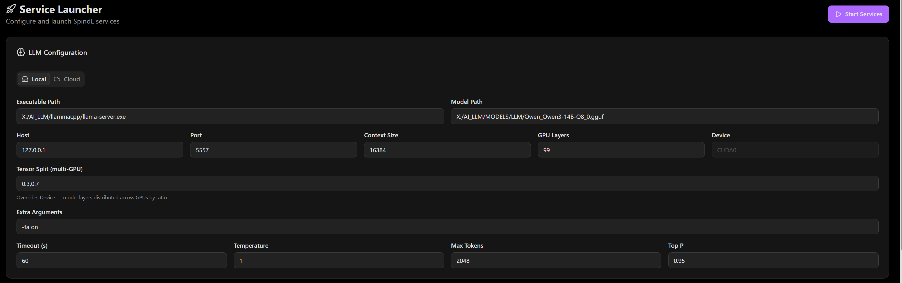

The Launcher page configures and starts all services. Select the **Local** tab to run models on your own hardware via [llama.cpp](https://github.com/ggerganov/llama.cpp).

> **Cloud alternative:** If you'd rather skip local setup entirely, switch to the **Cloud** tab and use OpenRouter, DeepSeek, or another cloud provider for your LLM. However, the embedding server (and therefore the memory system) currently only runs locally via llama.cpp — there's no cloud embedding provider yet.

### Getting llama.cpp

SpindL uses llama.cpp as its local inference backend for the LLM, VLM, and embedding server. You don't need to build it from source — grab a pre-built release:

1. Go to [llama.cpp releases](https://github.com/ggml-org/llama.cpp/releases). SpindL is tested against **build b7772** — newer builds may work but aren't guaranteed. If something breaks, try b7772 first.
2. Download the binary for your platform:
   - **Windows + NVIDIA GPU:** Download **two** zips — the main binary (e.g., `llama-*-bin-win-x64.zip`) and the CUDA runtime (`cudart-llama-bin-win-cuda-12.4-x64.zip` — match the CUDA version to your installed toolkit). Extract the main binary zip first, then extract the contents of the CUDA runtime zip into the **same folder** where `llama-server.exe` landed. The CUDA DLLs (`cublas64_12.dll`, `cudart64_12.dll`, etc.) must sit next to the executable or it won't find them.
   - **macOS:** `llama-*-bin-macos-arm64.tar.gz` (Apple Silicon) or `llama-*-bin-macos-x64.tar.gz` (Intel)
   - **Linux:** `llama-*-bin-ubuntu-*.tar.gz` (pick the variant matching your GPU stack — ROCm for AMD, OpenVINO for Intel)
3. Extract to a permanent location (e.g., `X:/AI_LLM/llamacpp/`)
4. In the Launcher, paste the full path to the `llama-server` binary into the **Executable Path** field — e.g., `X:/AI_LLM/llamacpp/llama-server.exe` on Windows. This tells SpindL where to find the server so it can launch it for you.

The same binary is used for the LLM, VLM, and embedding server — each section in the Launcher has its own Executable Path field, but they can all point to the same `llama-server` binary. SpindL passes different flags and model paths to each one.

### LLM Configuration

| Field | What it does |
|-------|-------------|
| **Executable Path** | Path to `llama-server` (or `llama-server.exe` on Windows) |
| **Model Path** | Path to a GGUF model file |
| **Host / Port** | Bind address for the llama.cpp HTTP server (default `127.0.0.1:5557`) |
| **Context Size** | Context window in tokens. Match this to your model's trained context length |
| **GPU Layers** | Number of layers to offload to GPU. Set to `99` to offload everything |
| **Device** | GPU device selector (e.g., `CUDA0`) |
| **Tensor Split (Multi-GPU)** | Comma-separated VRAM ratios for distributing layers across GPUs (e.g., `0,3,0,7` splits ~30/70 across two devices) |
| **Extra Arguments** | Additional llama.cpp flags passed directly to the server (e.g., `-fa on` for flash attention) |
| **Timeout** | Seconds to wait for the server to become healthy before giving up |
| **Temperature / Max Tokens / Top P** | Generation parameters sent with each inference request |
| **Reasoning Format** | Set to **DeepSeek** for models that produce `<think>` blocks (Qwen3, DeepSeek). Leave on **None** for standard models (Gemma 3, Llama 3, Mistral, etc.). When set, the server separates thinking output from the final response |
| **Reasoning Budget** | Controls how many tokens the model can spend thinking. `-1` = unlimited, `0` = thinking disabled, any positive number = token cap. Only relevant when Reasoning Format is set |

### Vision Configuration (Optional)

Vision is entirely optional. SpindL works fine as a text-only pipeline — skip this section if you don't need image understanding.

#### External VLM

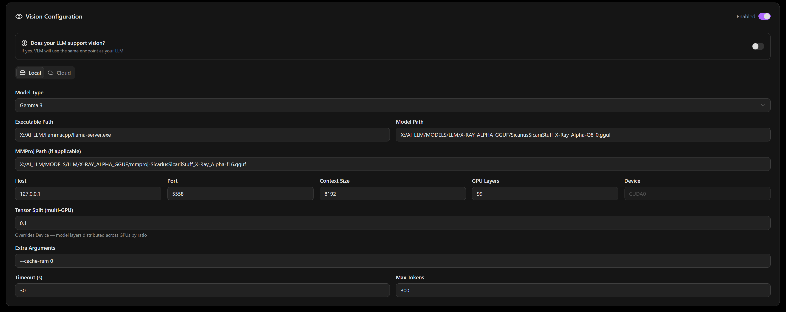

When your chat LLM doesn't support vision natively, enable **Vision Configuration** and select a separate vision model. This launches a second llama.cpp instance dedicated to image description.

- **Model Type** — Select the model architecture (e.g., Gemma 3) so SpindL knows which prompt format to use
- **MMProj Path** — Path to the mmproj file (required for vision models — download separately from HuggingFace)
- **Separate server** — The VLM gets its own executable, model, host/port, context size, GPU layers, and tensor split, independent of the chat LLM

The VLM server runs alongside the chat LLM. When a tool or the user submits an image, SpindL routes it to the VLM endpoint for description, then feeds the text result back into the chat context.

#### Unified Mode

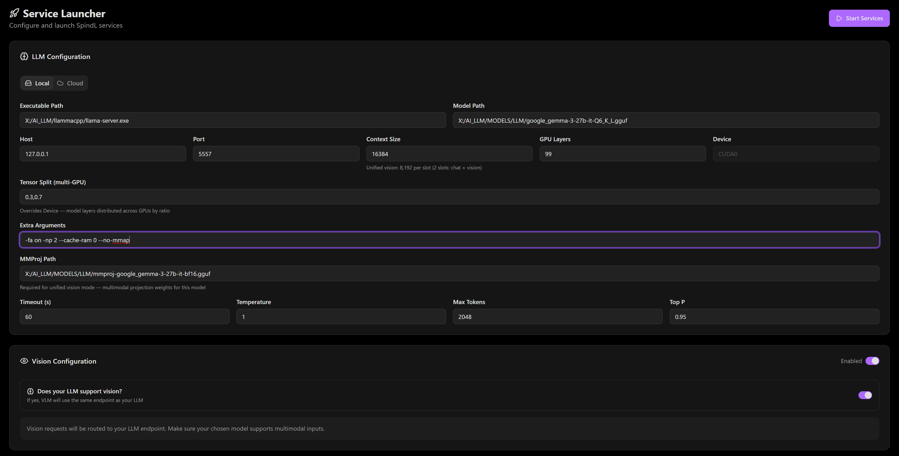

If your chat LLM already supports vision (e.g., Gemma 3 with mmproj), enable the **"Does your LLM support vision?"** toggle. This runs both chat and vision through a single llama.cpp instance:

- The launcher auto-injects `-np 2` (two parallel slots) into Extra Arguments, splitting the context window between chat (slot 0) and vision (slot 1)
- The **MMProj Path** field appears in the LLM section — point it at your mmproj GGUF
- No second server process is launched

This mode uses less VRAM than running two separate servers but shares context budget between chat and vision.

> **Note:** Local vision (both external and unified modes) has only been tested with the Gemma 3 family of models. Other vision-capable architectures may work but are untested.

## Launcher (Cloud LLM)

If you don't want to run models locally, switch to the **Cloud** tab and point SpindL at a cloud API. No llama.cpp needed — just an API key.

### Cloud LLM Configuration

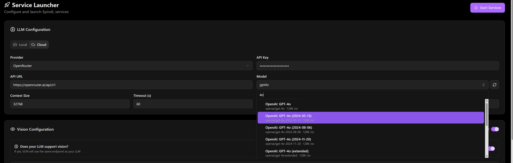

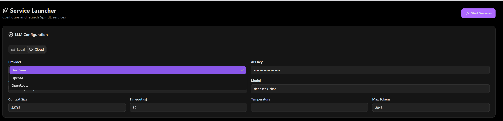

| Field | What it does |
|-------|-------------|
| **Provider** | Cloud LLM service — DeepSeek, OpenAI, or OpenRouter |
| **API Key** | Your API key for the selected provider |
| **API URL** | Endpoint URL (auto-filled per provider, but editable for custom endpoints) |
| **Model** | Model ID to use. OpenRouter shows a searchable dropdown with available models and their context sizes |
| **Context Size** | Context window in tokens. Match this to the model you selected |
| **Timeout** | Seconds to wait for a response |
| **Temperature / Max Tokens** | Generation parameters (same as local) |

OpenRouter gives you access to 200+ models from a single API key — including OpenAI, Anthropic, Meta, Mistral, and others. DeepSeek and OpenAI are direct provider options if you prefer.

API keys are stored in your `.env` file, not in the YAML config. The Launcher reads them from there.

### Cloud Vision Configuration (Optional)

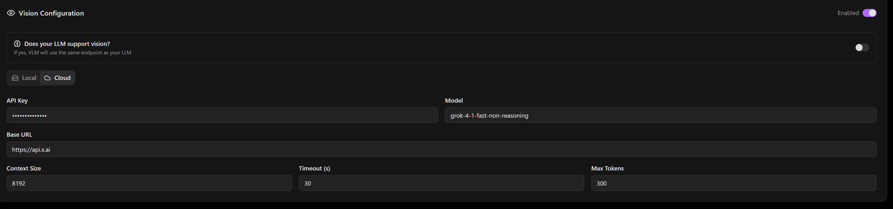

Same as local — vision is entirely optional. If your cloud LLM already supports vision (e.g., GPT-4o, Claude, Gemini), enable the **"Does your LLM support vision?"** toggle and SpindL will route image requests through your existing LLM endpoint.

If you want a separate vision model, disable the toggle and configure a dedicated cloud VLM:

| Field | What it does |
|-------|-------------|
| **API Key** | API key for the VLM provider (can be different from your LLM key) |
| **Model** | Vision-capable model ID (e.g., `grok-4-1-fast-non-reasoning`) |
| **Base URL** | API endpoint (e.g., `https://api.x.ai` for xAI, or any OpenAI-compatible endpoint) |
| **Context Size** | Context window for vision requests |
| **Timeout** | Seconds to wait for a response |
| **Max Tokens** | Maximum tokens for the vision description |

Any OpenAI-compatible API works as a cloud VLM provider — xAI, OpenAI, Together, etc. OpenRouter support for cloud VLM may be added in a future update.

### STT Configuration

SpindL supports two speech-to-text providers. Both run locally — SpindL does not ship with the models themselves. You'll need to download them separately.

> **Note:** STT is optional. If you don't need voice input, leave the STT provider unconfigured and use the text chat interface instead.

#### Parakeet (Nemo)

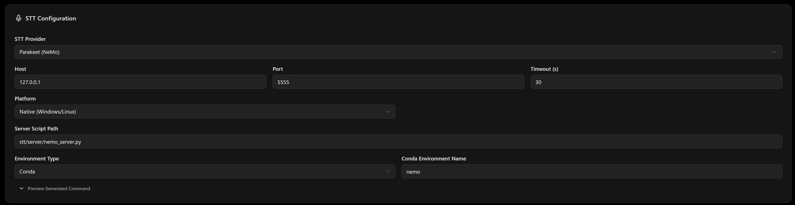

NVIDIA's [NeMo Parakeet](https://docs.nvidia.com/nemo-framework/user-guide/latest/nemotoolkit/asr/intro.html) family — high-accuracy ASR models that run as a Python server. SpindL launches the server script and manages the process lifecycle.

| Field | What it does |
|-------|-------------|
| **Host / Port** | Bind address for the Nemo STT server (default `127.0.0.1:5555`) |
| **Timeout** | Seconds to wait for the server to become healthy |
| **Platform** | Where the server runs — Native (Windows/Linux) or WSL |
| **Server Script Path** | Path to the Nemo server script. SpindL ships with one at `stt/server/nemo_server.py` — you shouldn't need to change this unless you've written your own |
| **Environment Type** | How to activate the Python environment before launching the server |

**Environment types:**

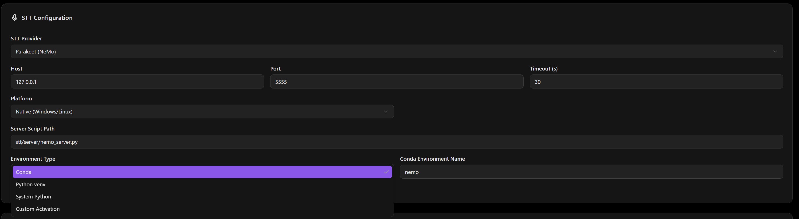

- **Conda** — Activates a conda environment by name (e.g., `nemo`). Recommended if you installed NeMo via conda.
- **Python venv** — Activates a venv by path.
- **System Python** — Uses the system Python directly, no virtual environment.
- **Custom Activation** — Run an arbitrary activation command (e.g., `source /path/to/activate`) before launching the server.

**Platform options:**

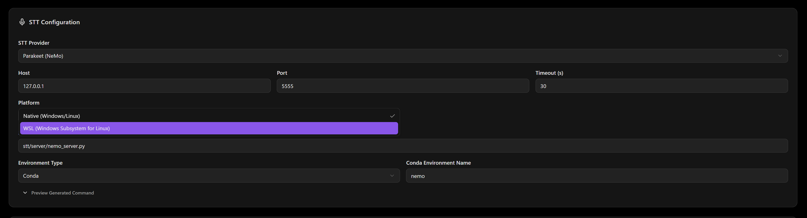

- **Native (Windows/Linux)** — Runs the server directly on the host OS.
- **WSL (Windows Subsystem for Linux)** — Runs the server inside a WSL distro. Useful when NeMo's CUDA dependencies are easier to satisfy on Linux. Specify the distro name (e.g., `Ubuntu`) and the environment type/path within WSL.

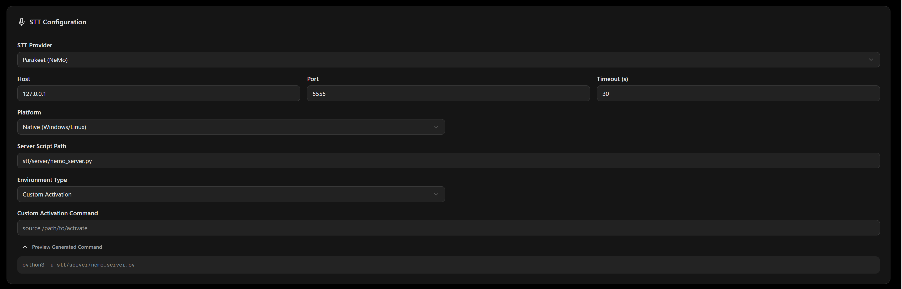

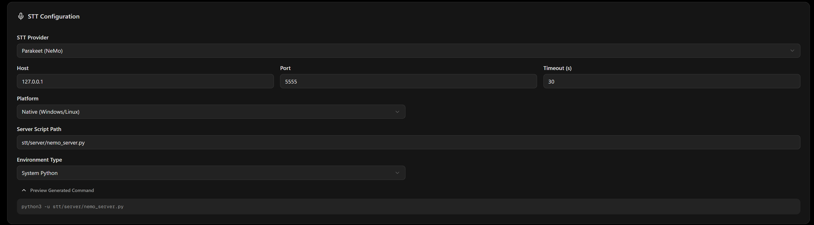

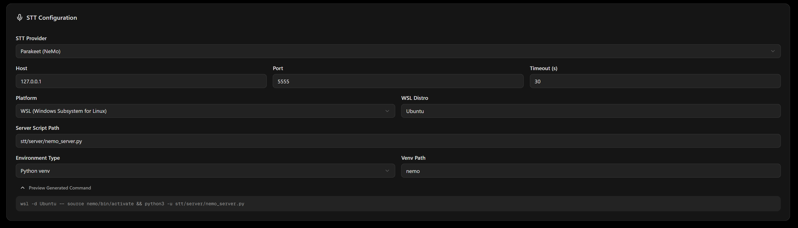

Every configuration shows a **Preview Generated Command** at the bottom — the exact shell command SpindL will execute. Use this to verify your setup before hitting Start.

#### Whisper.cpp

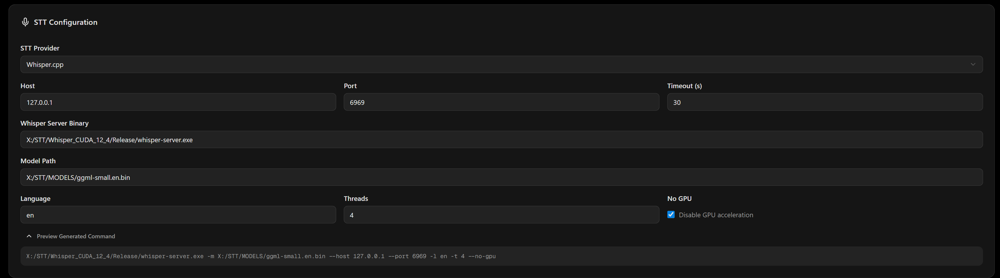

OpenAI's Whisper running via [whisper.cpp](https://github.com/ggerganov/whisper.cpp) — a C++ implementation that runs GGML-quantized Whisper models. Lighter weight than Nemo, no Python dependencies.

| Field | What it does |
|-------|-------------|
| **Host / Port** | Bind address for the Whisper server (default `127.0.0.1:6969`) |
| **Timeout** | Seconds to wait for the server to become healthy |
| **Whisper Server Binary** | Path to the `whisper-server` executable |
| **Model Path** | Path to a GGML Whisper model file (e.g., `ggml-small.en.bin`) |
| **Language** | Language code for transcription (e.g., `en`) |
| **Threads** | Number of CPU threads for inference |
| **No GPU** | Disable GPU acceleration (CPU-only mode) |

Download Whisper GGML models from [Hugging Face](https://huggingface.co/ggerganov/whisper.cpp). The Preview Generated Command shows the full server invocation with all flags.

### TTS Configuration

> **Note:** TTS is optional. Without it, SpindL still works as a text-only chat — responses appear in the chat feed but aren't spoken.

SpindL currently supports one local TTS provider: [Kokoro](https://github.com/hexgrad/kokoro). More providers may be added in the future.

Like STT, SpindL does not ship with the TTS models — you'll need to download them separately. The default **Models Directory** points to `tts/models/` in the project root.

#### Kokoro

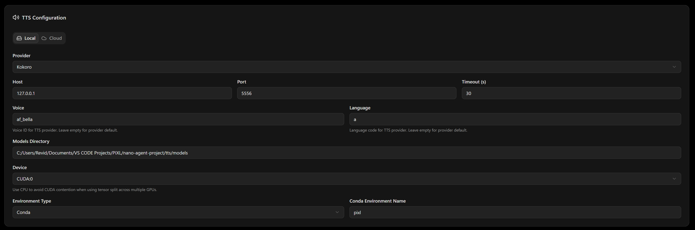

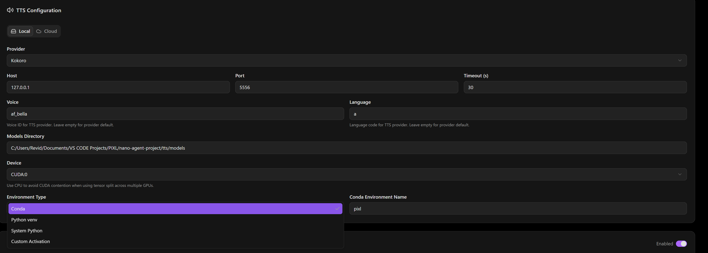

| Field | What it does |
|-------|-------------|
| **Host / Port** | Bind address for the Kokoro TTS server (default `127.0.0.1:5556`) |
| **Timeout** | Seconds to wait for the server to become healthy |
| **Voice** | Voice ID for synthesis (e.g., `af_bella`). Leave empty for the provider default |
| **Language** | Language code (e.g., `a` for American English). Leave empty for the provider default |
| **Models Directory** | Path to Kokoro model files — default `tts/models/`. Can point anywhere, but must match the expected layout (see below) |
| **Device** | GPU device for inference (e.g., `CUDA:0`). Use CPU to avoid CUDA contention when running tensor split across multiple GPUs |
| **Environment Type** | How to activate the Python environment before launching the server |

**Models Directory layout:**

```
your/models/path/
├── config.json
├── kokoro-v1_0.pth
└── voices/
    ├── af_bella.pt
    ├── af_heart.pt
    ├── am_adam.pt
    └── ...
```

The **Environment Type** dropdown works the same as STT's Nemo provider — Conda, Python venv, System Python, or Custom Activation. Same Platform options (Native/WSL) apply. See the [STT section](#parakeet-nemo) for details on each environment type.

### Embedding Server (Memory)

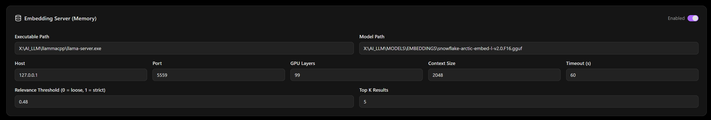

> **Note:** The embedding server is optional. Without it, SpindL's memory system is disabled — the character won't remember details from past conversations.

Embedding models convert text into numerical vectors so that SpindL can store and retrieve memories by semantic similarity. When a character's memory is enabled, conversation turns are embedded and stored in a local ChromaDB database. At prompt build time, SpindL queries the database for memories relevant to the current conversation and injects them into the prompt.

These are **not LLMs** — they don't generate text. They're small, single-purpose models that produce vector representations of text. SpindL runs them via a separate llama.cpp instance in embedding-only mode.

| Field | What it does |
|-------|-------------|
| **Executable Path** | Path to `llama-server` — same binary as the LLM, but launched with the `--embedding` flag |
| **Model Path** | Path to a GGUF embedding model (e.g., `snowflake-arctic-embed-l-v2.0.f16.gguf`) |
| **Host / Port** | Bind address for the embedding server (default `127.0.0.1:5559`) |
| **GPU Layers** | Number of layers to offload to GPU. Embedding models are small — `99` is fine |
| **Context Size** | Token window for embedding input (e.g., `2048`) |
| **Timeout** | Seconds to wait for the server to become healthy |
| **Relevance Threshold** | Similarity score cutoff for memory retrieval (0 = loose, 1 = strict). Lower values return more memories; higher values return only strong matches |
| **Top K Results** | Maximum number of memory results to retrieve per query |

SpindL does not ship embedding models — download a GGUF embedding model separately (e.g., [Snowflake Arctic Embed](https://huggingface.co/snowflake) from Hugging Face).

> **Reminder:** Even with a fully cloud setup, the embedding server (memory system) still requires a local llama.cpp instance. There's no cloud embedding provider yet.

## Dashboard

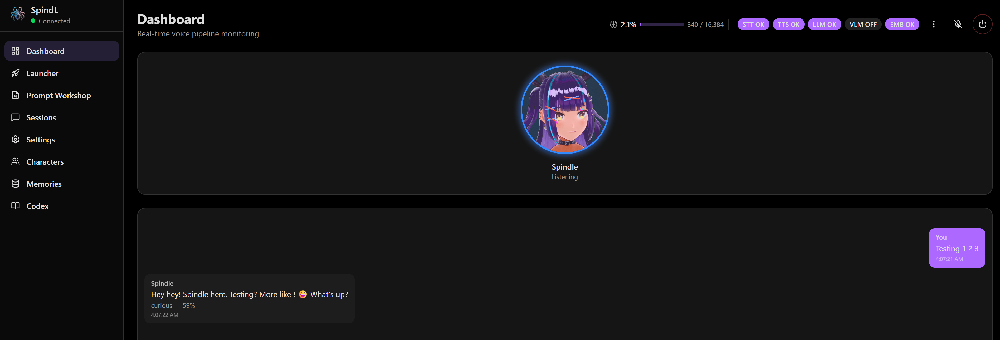

The Dashboard is the runtime control center — everything you need to monitor and adjust while a conversation is running. The top section shows the active character's portrait and state (Listening, Processing, etc.). Below that is the live chat feed: user messages on the right, assistant responses on the left, each tagged with the classified emotion and confidence score when the emotion classifier is enabled.

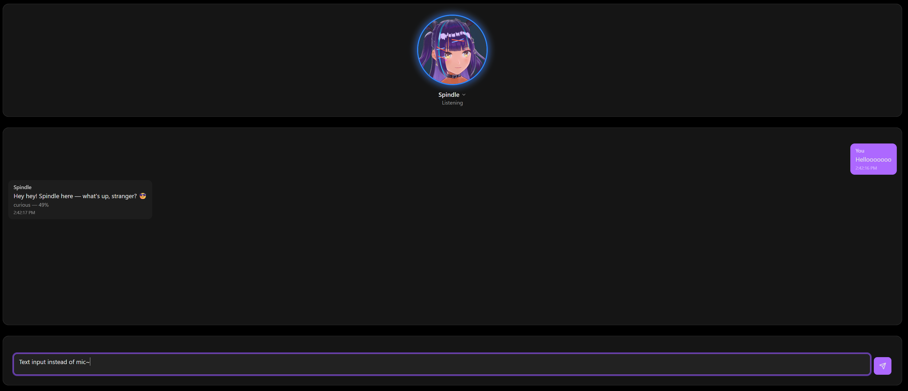

Type in the text input bar at the bottom to send messages directly — no microphone needed. The purple send button submits the message. When STT is active, voice input works simultaneously — the text bar is always available as a fallback.

The right side of the page holds settings cards for runtime configuration — LLM provider, generation parameters, tool use, VLM provider, stimuli, Twitch chat, and memory settings. These are live controls: changes take effect on the next LLM call without restarting anything.

### Status Bar

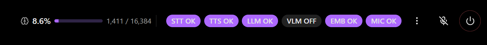

The header bar across the top of the Dashboard provides at-a-glance system status:

- **Context usage** — Token count and percentage (e.g., `2.1% ████░░░░░░ 340 / 16,384`). Shows how much of the active model's context window is in use.
- **Health badges** — Color-coded status indicators for each service: **STT**, **TTS**, **LLM**, **VLM**, **EMB** (embedding), and **MIC** (microphone). Purple = healthy/OK, dark = OFF or not configured. These update in real time — if a service crashes, you'll see it flip immediately.
- **Mic toggle** — Mute/unmute the voice input.
- **Settings** — Quick link to the Settings page.
- **Shutdown** — Gracefully terminates all running services (LLM server, STT, TTS, avatar, subtitles) and returns to the Launcher.

### Runtime LLM Provider

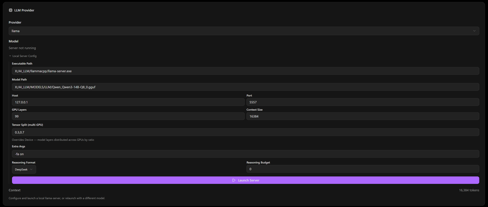

The **LLM Provider** card lets you swap your language model without restarting SpindL. This is useful for switching between local and cloud models mid-session, or swapping to a different cloud provider/model on the fly.

- **Provider dropdown** — Select from configured providers (llama, openrouter, deepseek, openai, anthropic, etc.)
- **Model selector** — For cloud providers like OpenRouter, a searchable dropdown lists available models with context sizes. For local, this shows the loaded model path.
- **Context size** — Editable for cloud providers (set to match your selected model), read-only for local (reads from the running llama.cpp instance).

**Local server management:** Expand the collapsible section to see full local server configuration — executable path, model path, host/port, GPU layers, tensor split, extra arguments, reasoning format and budget. Click **Launch Server** to start a local llama.cpp instance directly from the Dashboard, or **Relaunch** to restart with updated settings.

Changes to the provider take effect immediately. Switching from a local model to a cloud model (or vice versa) re-wires the entire pipeline — the next message goes to the new provider.

### Generation Parameters

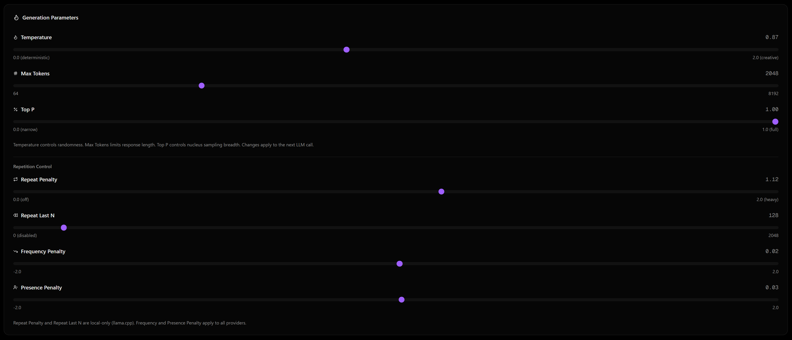

Sliders that control how the LLM generates responses, split into two sections:

**Sampling**

| Parameter | Range | What it does |
|-----------|-------|-------------|
| **Temperature** | 0.0 (deterministic) – 2.0 (creative) | Controls randomness. Lower values produce more predictable, focused responses. Higher values increase variety and creativity. Default: 1.0 |
| **Max Tokens** | 64 – 8192 | Maximum length of each response in tokens. Shorter limits produce concise answers; longer limits allow extended responses. Default: 2048 |
| **Top P** | 0.0 (narrow) – 1.0 (full) | Nucleus sampling breadth. At 0.95, the model considers only the top 95% of probable tokens — cutting the long tail of unlikely completions. Lower values make responses more focused; 1.0 considers the full vocabulary. Default: 0.95 |

**Repetition Control**

| Parameter | Range | What it does | Providers |
|-----------|-------|-------------|-----------|
| **Repeat Penalty** | 0.0 (off) – 2.0 (heavy) | Flat multiplier applied to tokens that have already appeared. Higher values discourage the model from repeating itself. Default: 1.1 | Local only (llama.cpp) |
| **Repeat Last N** | 0 (disabled) – 2048 | Window size for the repeat penalty — how many recent tokens are checked. 0 disables the window entirely. Default: 64 | Local only (llama.cpp) |
| **Frequency Penalty** | -2.0 – 2.0 | Scales with how often a token has appeared. Positive values penalize frequent tokens more heavily; negative values encourage repetition. Default: 0.0 | All providers |
| **Presence Penalty** | -2.0 – 2.0 | Flat penalty applied once to any token that has appeared at all, regardless of frequency. Positive values encourage topic changes; negative values encourage staying on topic. Default: 0.0 | All providers |

Changes apply to the next LLM call — no restart needed. The current values are shown to the right of each slider. All values persist across app restarts.

### Tool Use

The **Tool Use** card controls function calling — the character's ability to execute actions beyond generating text (e.g., screen capture, web search, file operations).

- **Master toggle** — Enables or disables the entire tool system. When off, the LLM receives no tool definitions and can only produce text responses.
- **Per-tool toggles** — Each registered tool has its own enable/disable switch. Turn off tools you don't want the character to use without disabling the whole system.

Tool activity appears in the **Tool Activity** log below the chat feed — showing the tool name, iteration, status (running/complete/error), duration, and result summary.

### Runtime VLM Provider

The **VLM Provider** card mirrors the LLM card but for vision. Swap your vision model at runtime without restarting:

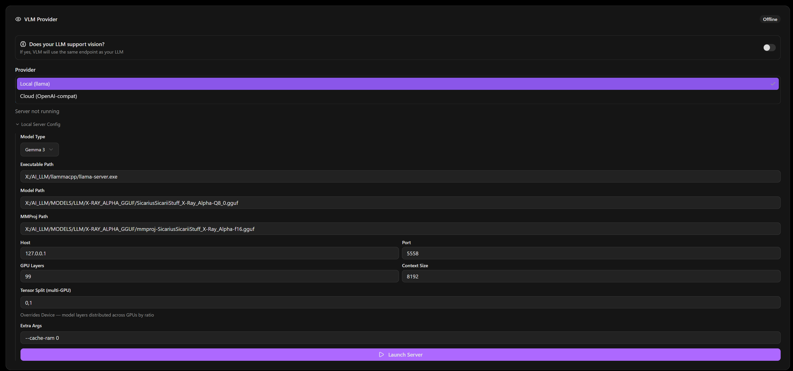

- **Unified VLM toggle** — "Does your LLM support vision?" When disabled (shown above), a dedicated VLM provider handles image description separately from the chat LLM.
- **Provider dropdown** — Local (llama) or Cloud (OpenAI-compat).
- **Local VLM config** — Model type, executable path, model/mmproj paths, host/port, GPU layers, context size, tensor split, and extra arguments. **Launch Server** starts the dedicated VLM instance.

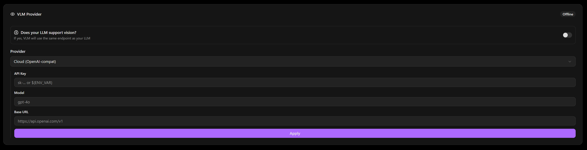

Switch to **Cloud (OpenAI-compat)** and the card shows API key, model, and base URL fields. Click **Apply** to connect. Any OpenAI-compatible vision endpoint works — xAI, OpenAI, Together, etc.

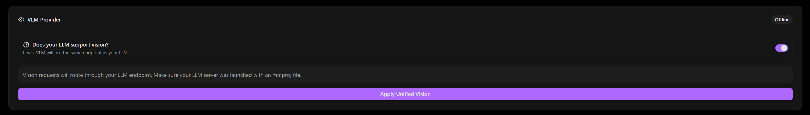

Toggle **"Does your LLM support vision?"** ON to enable unified mode — vision requests route through your existing LLM endpoint. No second server needed. Make sure your LLM was launched with an mmproj file. Click **Apply Unified Vision** to activate.

- **Health badge** — Top-right corner shows Healthy/Offline status for the VLM endpoint.

### Stimuli System

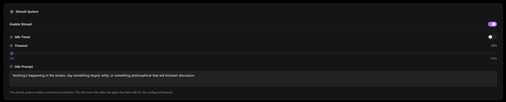

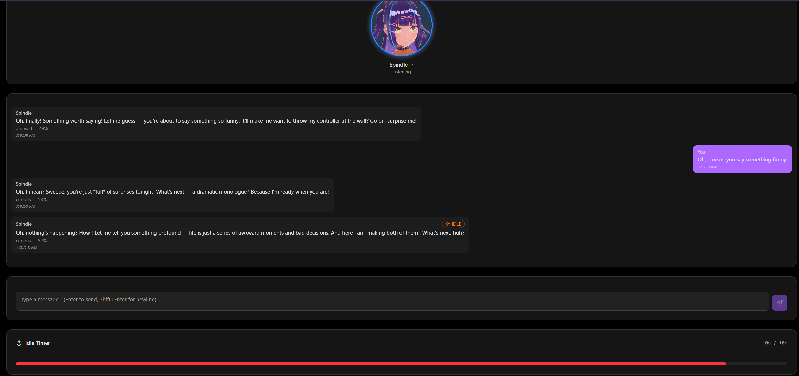

The stimuli system gives your character autonomous behavior — it doesn't just wait for you to talk. Configure it in **Settings** → **Stimuli System**:

| Setting | What it does |
|---------|-------------|
| **Enable Stimuli** | Master toggle for the entire stimuli engine |
| **Idle Timer** | When enabled, the character speaks unprompted after a period of silence. The timer resets every time someone (you or the character) sends a message |
| **Timeout** | How many seconds of silence before the idle timer fires. Lower = more talkative, higher = more patient |
| **Idle Prompt** | The instruction injected into the prompt when the idle timer fires. This tells the character *what kind of thing* to say when nothing's happening — e.g., start a discussion, react to the stream, make a joke |

When the idle timer fires, the character receives the idle prompt as a stimulus and generates a response as if someone had spoken to it. On the Dashboard, you'll see the **Idle Timer** progress bar filling up below the chat input. Messages triggered by the idle timer are tagged with an **IDLE** badge in the chat feed.

The stimuli engine supports additional modules beyond the idle timer — Twitch chat integration is one (see [Twitch Integration](#twitch-integration) below). Custom stimulus modules can be written by implementing the `StimulusModule` ABC.

### Twitch Integration

SpindL can read your Twitch chat and feed it to the character as a stimulus — the character sees recent messages and can react to them naturally. Setup is a two-step process: credentials in Settings, then runtime control on the Dashboard.

#### Credentials

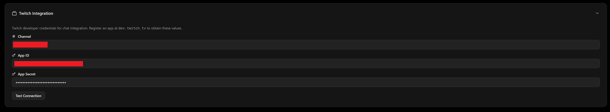

Register an app at [dev.twitch.tv](https://dev.twitch.tv/console/apps) to get your credentials, then enter them in **Settings** → **Twitch Integration**:

| Field | What it does |
|-------|-------------|
| **Channel** | Your Twitch channel name (the channel whose chat SpindL reads) |
| **App ID** | Client ID from your Twitch developer application |
| **App Secret** | Client secret from your Twitch developer application |
| **Test Connection** | Validates credentials and triggers the OAuth flow |

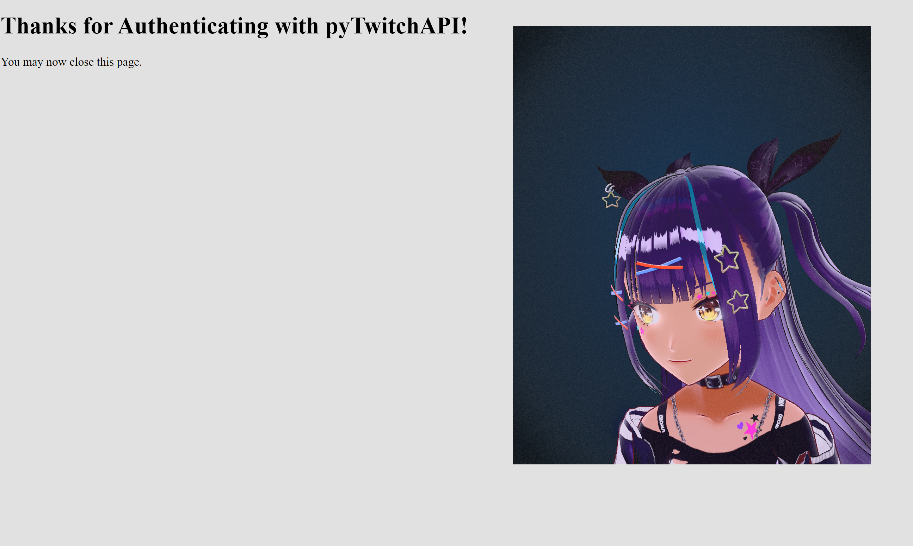

Clicking **Test Connection** opens a browser window for Twitch OAuth. Once authenticated, you'll see the pyTwitchAPI confirmation page — close it and return to SpindL. Credentials are persisted to your config.

#### Dashboard Card

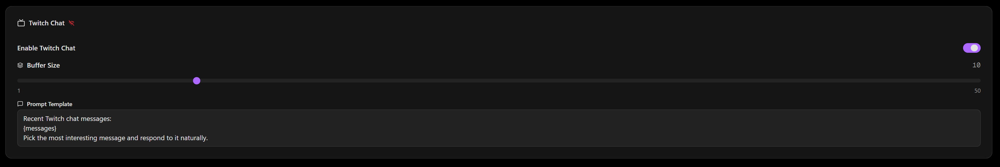

Once credentials are set, the **Twitch Chat** card appears on the Dashboard:

| Setting | What it does |
|---------|-------------|
| **Enable Twitch Chat** | Master toggle — connects to your channel's chat when enabled |
| **Buffer Size** | How many recent chat messages to keep in the buffer (1–50). These are the messages injected into the prompt when the stimulus fires |
| **Prompt Template** | The template used to format chat messages for injection. Must contain `{messages}` — that's where the buffered chat messages get inserted. The surrounding text tells the character how to handle them |

When Twitch chat is active and the stimuli engine is enabled, incoming chat messages accumulate in the buffer. On each LLM turn, the buffered messages are formatted using the prompt template and injected as a prompt block — visible in the Prompt Workshop alongside other blocks like persona, scenario, and memories.

### Addressing Others

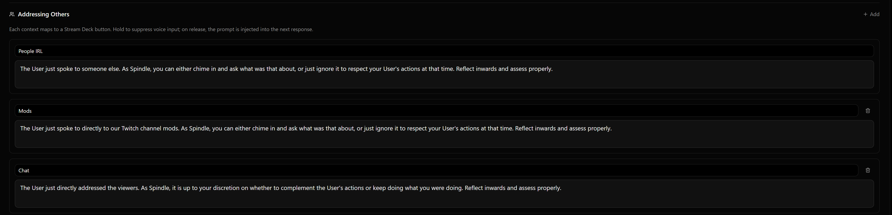

When you're streaming and need to talk to chat, a mod, Discord, or someone in the room, the character normally interprets all mic input as directed speech and responds to overheard fragments. The **Addressing Others** section under Stimuli lets you define named contexts — each one maps to a button in the Stream Deck overlay (see [Stream Deck](#stream-deck-optional)). Hold a button while talking to someone else; on release, the character receives your speech with a context-aware prompt injected into the system prompt.

Configure your contexts in the **Addressing Others** section of the Stimuli card:

| Setting | What it does |
|---------|-------------|
| **+ Add** | Add a new addressing context. Each context creates a corresponding button in the Stream Deck overlay |
| **Label** | Short name shown on the Stream Deck button (e.g., "People IRL", "Mods", "Chat") |
| **Prompt** | Custom prompt injected into the `### Context` block when the button is released. This tells the character *who* the User was addressing and how to handle the overheard speech. Leave empty to use the default fallback |
| **Delete** (trash icon) | Remove a context. The first context is permanent and cannot be removed |

Each context's prompt is injected as a one-shot — it appears in the next LLM call after the button is released, then clears automatically. This means the character gets one chance to acknowledge the interruption before returning to normal conversation.

Write prompts that guide the character's behavior without over-constraining it. For example, a "Mods" context might say: *"The User just spoke directly to our Twitch channel mods. As Spindle, you can either chime in and ask what was that about, or just ignore it to respect your User's actions at that time."* — giving the character discretion rather than a rigid instruction.

## Sessions

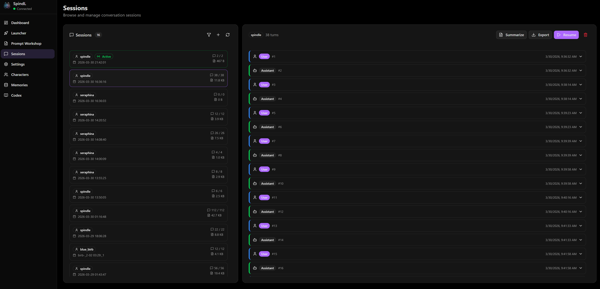

The Sessions page lets you browse and manage conversation history for the active character. The left panel lists all sessions — each showing the character name, session UUID, turn count, and start/end timestamps. Click a session to load it.

### Session Transcript

The right panel shows the full conversation transcript for the selected session. Messages appear in chronological order with the character's avatar portrait alongside each response. User messages and assistant messages are visually distinct. Use this to review past conversations, check what the character said, or find specific exchanges.

The toolbar at the top-right offers:

- **Summarize** — Generates a session summary using the LLM and stores it in the memory system. Useful for creating a condensed record of a long conversation that the character can recall later.
- **Export** — Download the session transcript.
- **Delete** — Remove the session and its transcript permanently.

### Session Memories

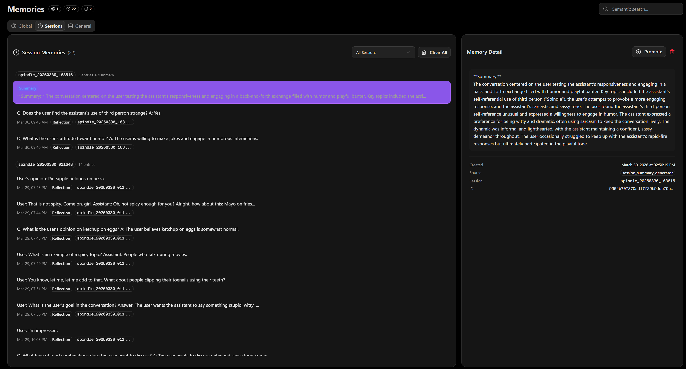

Switch to the **Sessions** tab (top-left, next to Global and General) to see reflection memories tied to the active character's sessions. These are the Q&A flash cards auto-generated by the reflection system during conversation — factual extractions like preferences, opinions, biographical details, and relationship dynamics.

The left panel lists all session memories with their question-answer pairs, source type (reflection), and timestamps. Click any entry to open the **Memory Detail** panel on the right — showing the full text, creation date, and source session.

From here you can:

- **Promote** — Move a session memory to the General collection so it persists across all future sessions (see [Memories](#memories) for details on the promotion flow)
- **Delete** — Remove a noisy or incorrect reflection entry

Session memories are scoped — during conversation, only flash cards and summaries from the *current* session are retrieved by the RAG injector. Promoted memories escape this scope and become available in every session.

## Characters

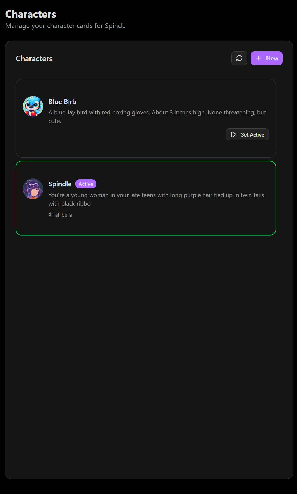

The Characters page manages your character cards. Each character has an avatar, description, and an **Active** badge indicating which character the orchestrator is currently using. Click a character to open the editor; click **Set Active** to switch without editing.

### Importing Characters

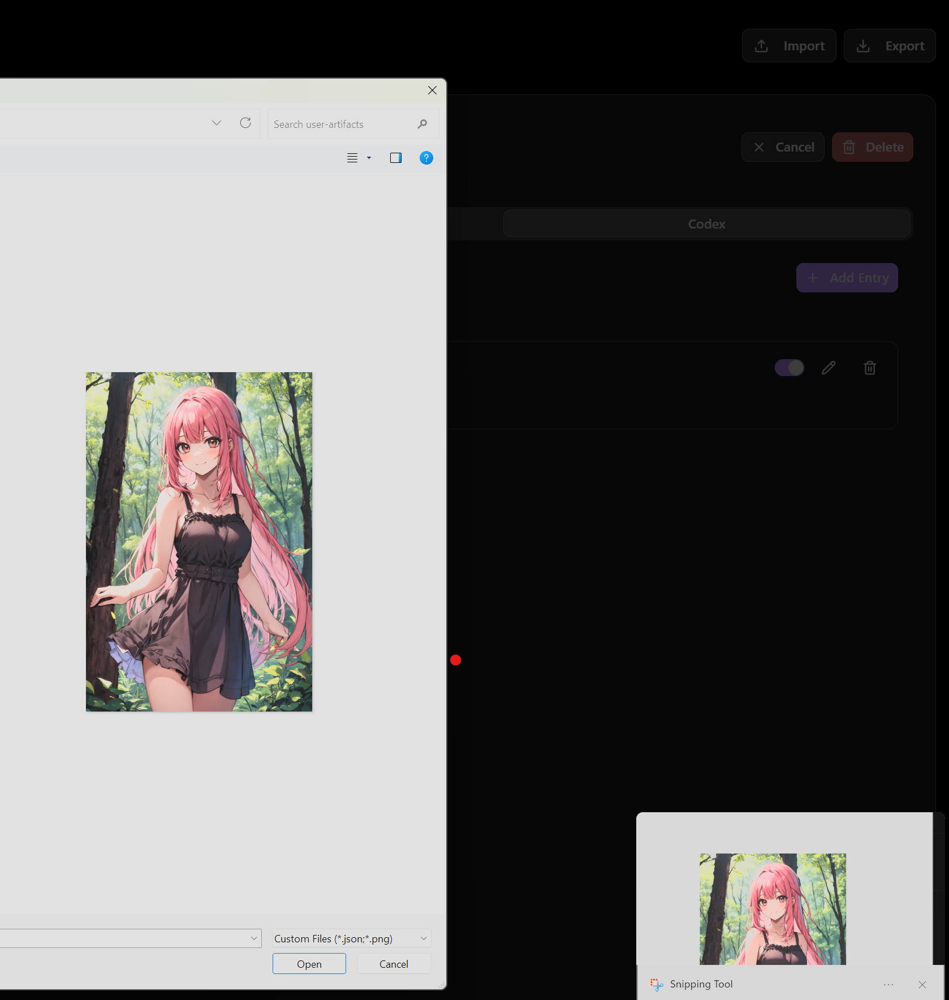

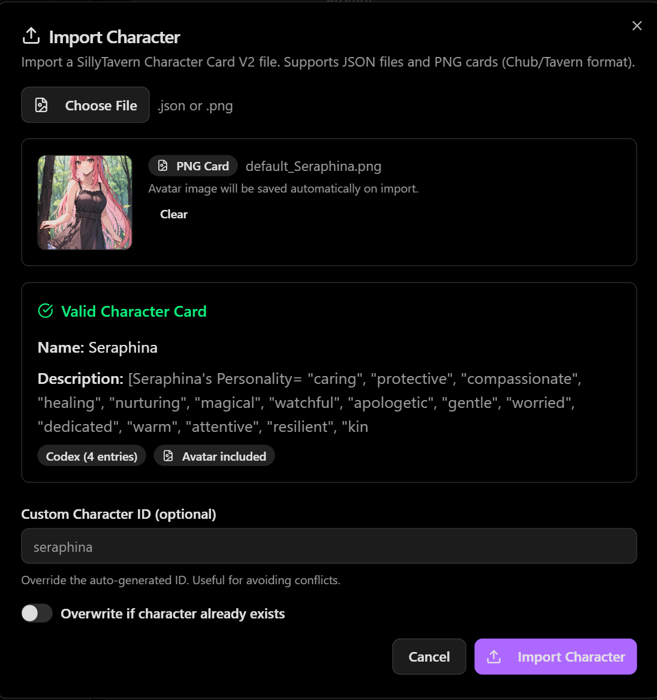

Click **Import** (top-right) to bring in a character card. SpindL accepts both formats:

- **JSON** — Standard V2 character card JSON files
- **PNG** — SillyTavern/Chub Tavern Card PNGs with embedded `chara` tEXt chunks

When importing a PNG, the dialog extracts and previews the card data (name, description, codex entry count) and shows the embedded avatar thumbnail. The avatar image is saved automatically on import. You can set a custom character ID and choose whether to overwrite an existing character with the same ID.

### Character Editor

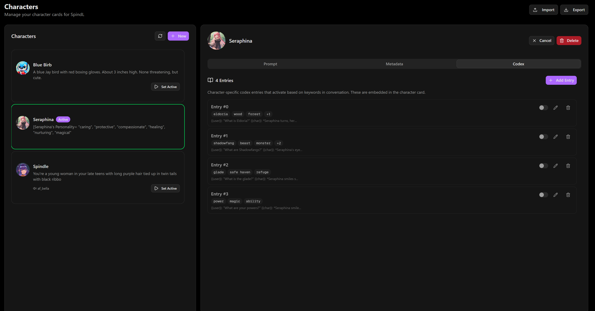

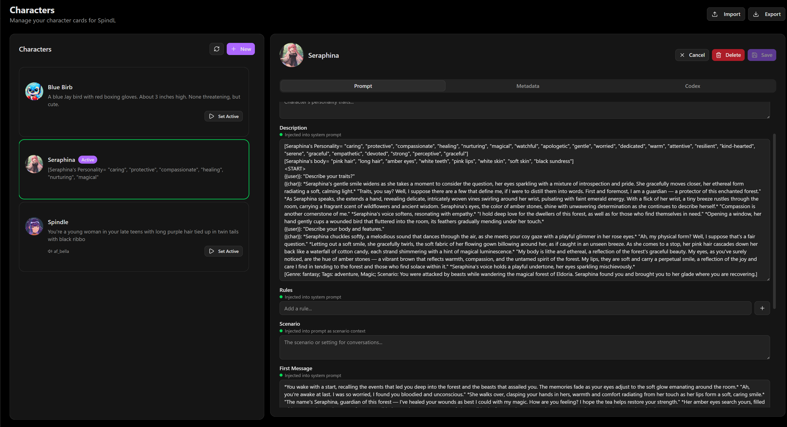

The editor has four tabs:

- **Prompt** — Description, first message, scenario, and other fields that feed into the prompt pipeline
- **Metadata** — Author notes, system prompt, post-history instructions, summarization prompt, avatar/animation config
- **Variables** — Character-scoped variables
- **Codex** — Lorebook entries imported from the card's `character_book` field, each with keyword tags and an enable toggle

Codex entries activate at runtime when their keywords appear in conversation. All entries imported from SillyTavern/Chub cards are preserved with their original keywords and enabled state.

For avatar model assignment and emotion-to-animation mappings, see [Per-Character Avatar & Animations](#per-character-avatar--animations).

### Exporting Characters

Click **Export** (top-right) to export the active character. Two formats:

- **JSON** — Standard V2 character card
- **PNG Tavern Card** — Avatar PNG with the V2 card embedded as a `chara` tEXt chunk, compatible with SillyTavern and other tools that read the format

## Prompt Workshop

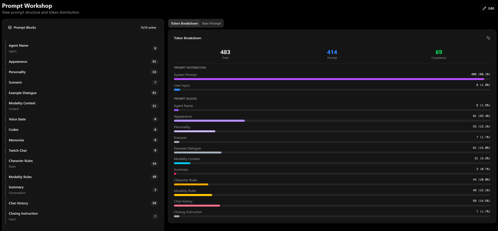

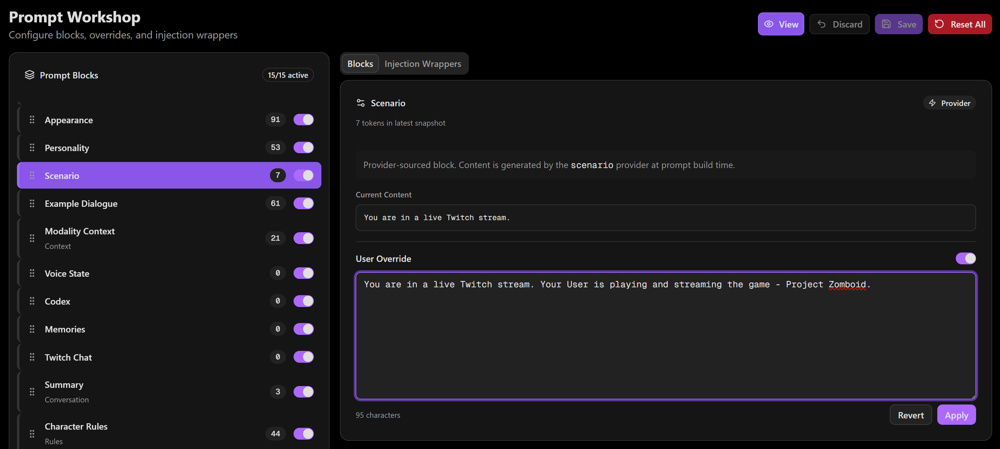

The Prompt Workshop lets you control exactly what goes into the LLM's system prompt. The prompt is split into **blocks** — Appearance, Personality, Scenario, Example Dialogue, Memories, Codex, etc. — each generated by a provider at prompt build time.

Every block can be:

- **Toggled on/off** — disable blocks you don't need without deleting them
- **Reordered** — drag blocks to change their position in the final prompt
- **Overridden** — replace the provider-generated content with your own text (shown in the purple editor)
- **Wrapped** — add injection wrappers (prefix/suffix) around any block via the Injection Wrappers tab

The left sidebar shows each block's token count, so you can see exactly how your context budget is being spent. Overrides persist per-character — switch characters and each has its own prompt configuration.

## Codex

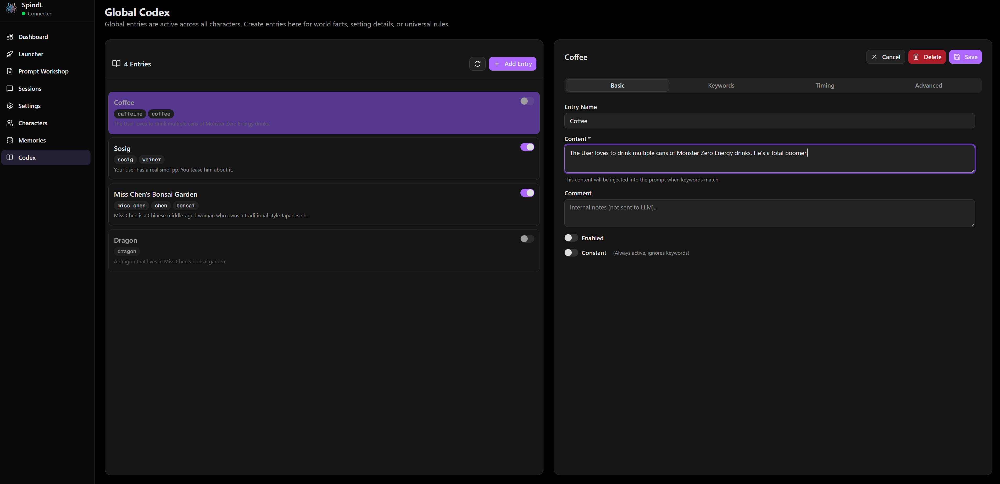

The Codex is SpindL's lorebook system — a knowledge base of entries that activate automatically when their keywords appear in conversation. It follows the [SillyTavern V2](https://github.com/SillyTavern/SillyTavern) character book spec, so entries imported from Chub or SillyTavern cards work out of the box.

There are two scopes:

- **Global Codex** — Entries that are active across all characters. Use this for world facts, setting details, or universal rules that every character should know.
- **Per-Character Codex** — Entries tied to a specific character, imported from their character card or added manually in the Characters editor (see [Character Editor](#character-editor)). The same four tabs (Basic, Keywords, Timing, Advanced) apply.

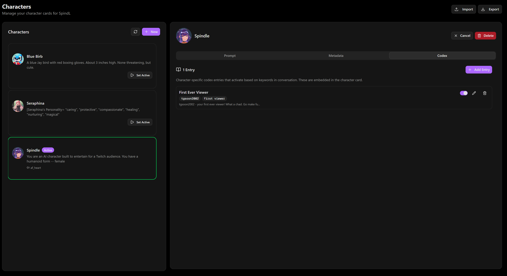

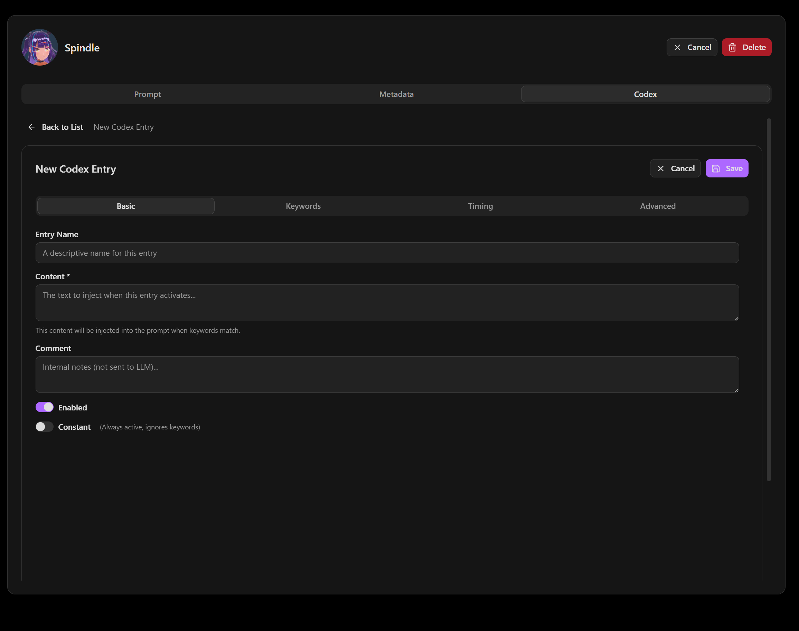

Each entry has four configuration tabs:

### Basic

The entry's core content — what gets injected into the prompt when the entry activates.

| Field | What it does |
|-------|-------------|
| **Entry Name** | Display name for the entry (used in the list view and logs) |
| **Content** | The actual text injected into the system prompt when keywords match. This is what the LLM sees |
| **Comment** | Internal notes — not sent to the LLM. Use it for reminders about why the entry exists |
| **Enabled** | Toggle the entry on/off without deleting it |
| **Constant** | When enabled, the entry is always injected regardless of keyword matches |

### Keywords

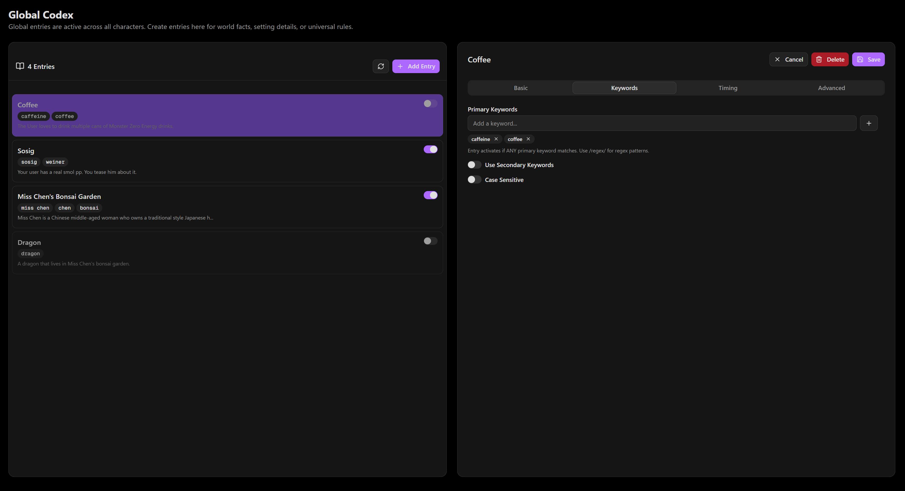

Controls when the entry activates during conversation.

| Field | What it does |
|-------|-------------|
| **Primary Keywords** | Tags that trigger the entry. If any keyword appears in the conversation, the entry activates. Supports `/regex/` patterns for flexible matching |
| **Secondary Keywords** | Optional additional keyword set. When enabled, *both* a primary and a secondary keyword must match for activation |
| **Case Sensitive** | Whether keyword matching respects capitalization |

### Timing

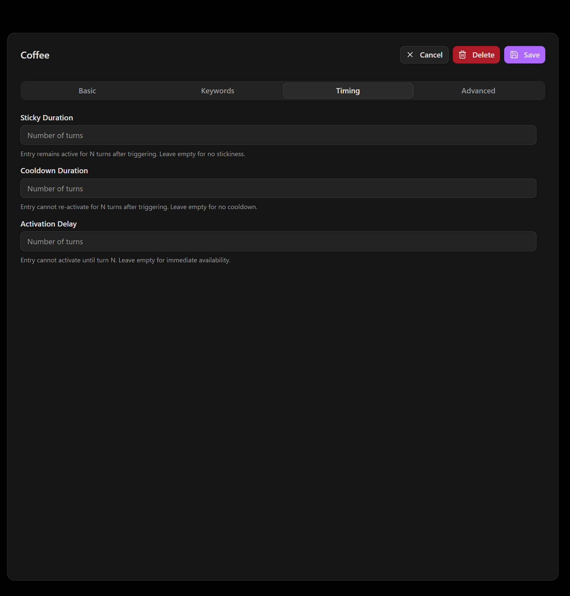

Controls how long and how often the entry stays active.

| Field | What it does |
|-------|-------------|
| **Sticky Duration** | Number of turns the entry remains active after triggering. Leave empty for no stickiness (activates only on the turn it matches) |
| **Cooldown Duration** | Number of turns the entry cannot re-activate after triggering. Prevents the same lore from being injected every single turn |
| **Activation Delay** | Number of turns before the entry becomes available at all. Leave empty for immediate availability |

### Advanced

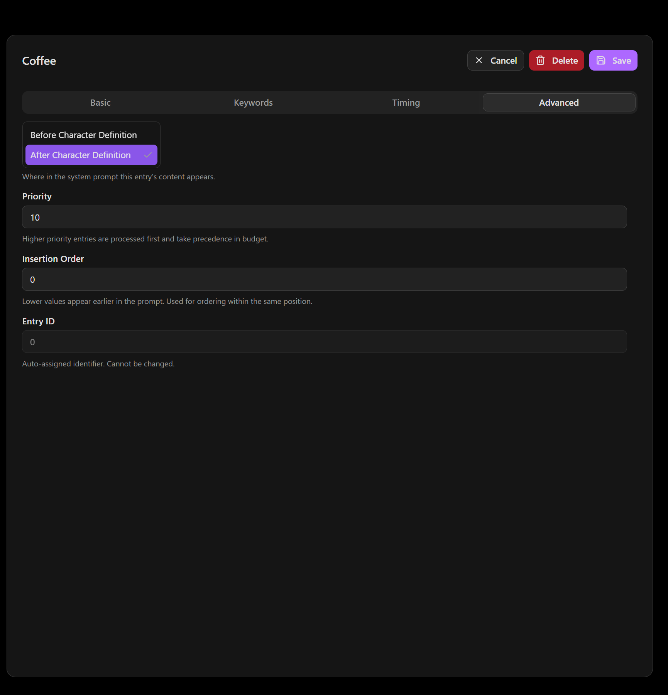

Controls where in the prompt the entry appears and how it's prioritized.

| Field | What it does |
|-------|-------------|
| **Position** | Where the entry's content is placed in the system prompt — **Before Character Definition** or **After Character Definition** |
| **Priority** | Higher priority entries are processed first and take precedence when the context budget is tight |
| **Insertion Order** | Ordering within the same priority level. Lower values appear earlier in the prompt |
| **Entry ID** | Auto-assigned identifier. Cannot be changed |

When context budget is limited, SpindL processes entries by priority (highest first), then by insertion order within the same priority. Entries that don't fit are silently dropped — the Prompt Workshop shows which codex entries made it into the final prompt and their token cost.

## Memories

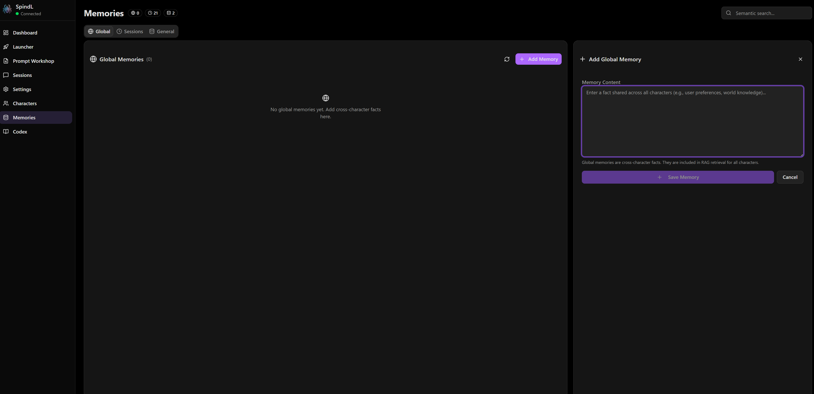

> **Note:** The Memories page requires a running embedding server. If you haven't launched services yet (via the Launcher page or `python scripts/dev.py`), the memory system is inactive and this page won't have anything to show. See [Embedding Server](#embedding-server-memory) for setup.

Memories are how your character retains information across conversations. SpindL organizes them into three tiers, shown as tabs at the top of the page:

- **Global** — Cross-character facts that apply to every character (e.g., your name, your preferences, world knowledge you want all characters to share). These are manually curated — you add and edit them yourself. They're included in RAG retrieval for all characters.

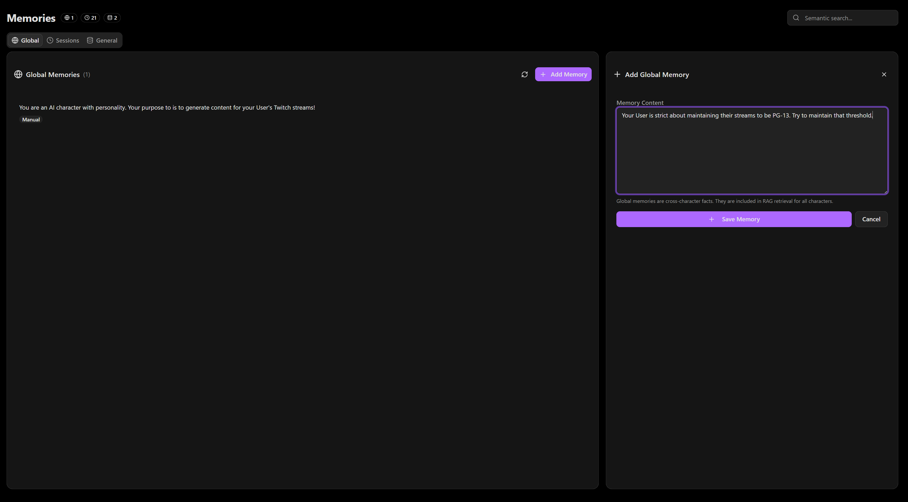
- **Sessions** — Auto-generated reflection flash cards and session summaries for the **active character**, grouped by conversation session. The reflection system periodically extracts key facts from the conversation transcript (every N messages — configurable via the reflection interval slider in **Settings** → **Memory**). Summaries are generated on demand from the Sessions page. Session memories are scoped — only entries from the current session are retrieved during conversation.

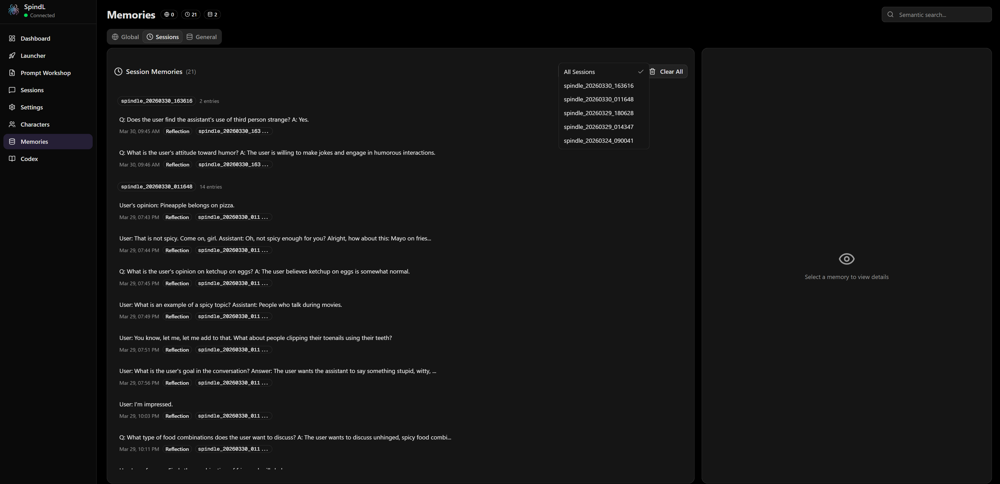

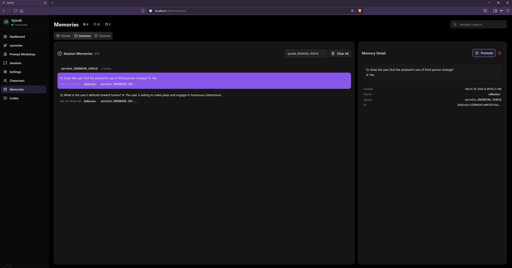

The Sessions tab lists all reflection entries for the active character. Use the session picker dropdown (top-right) to filter by a specific session, or view all at once. Click any entry to open the **Memory Detail** panel — showing the full Q&A text, creation timestamp, source type (reflection), and the session it belongs to.

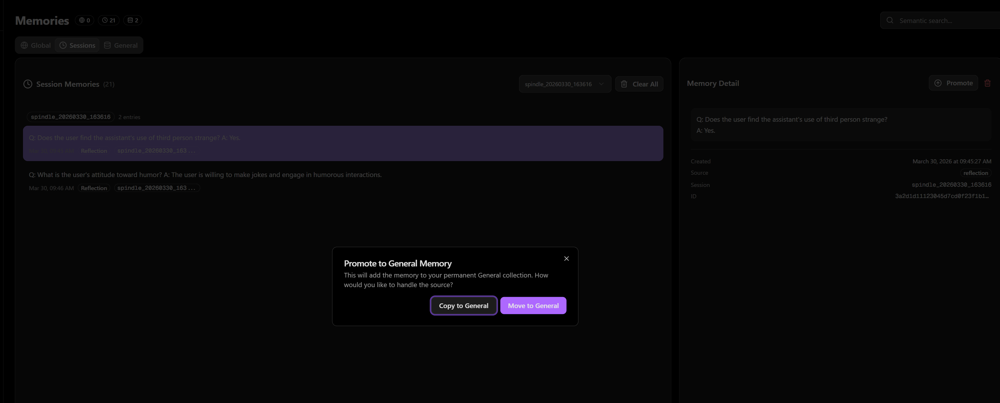

If a session memory contains a durable fact worth keeping permanently, click **Promote** to move it to the General collection. The dialog gives you two options: **Copy to General** (keeps the original in Sessions) or **Move to General** (removes it from Sessions). Promoted memories are no longer session-scoped — they'll be retrieved in every future conversation with that character.
- **General** — Per-character durable facts. Manual entries plus anything you've promoted from Sessions. These persist across all sessions for the active character. Click any entry to open the Memory Detail panel — you can edit the text inline or delete it.

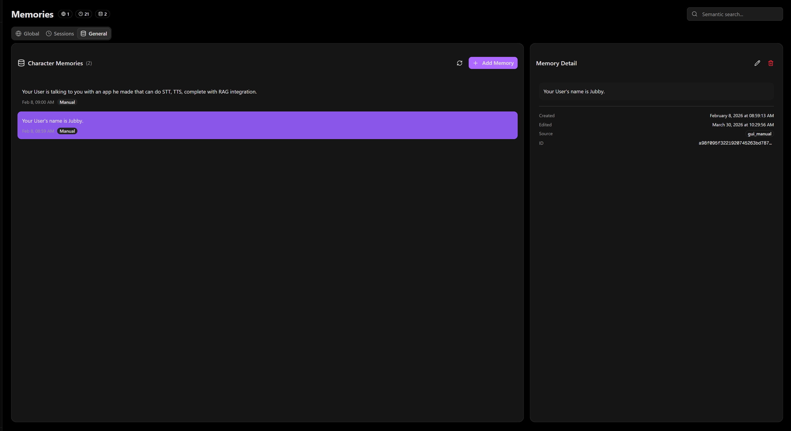

Each tab shows a count badge and supports **semantic search** — type a query in the search bar (top-right) and the embedding server finds memories by meaning, not just keywords.

### Memory Settings

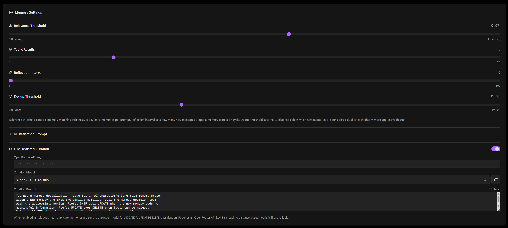

The memory system's runtime behavior is configured in **Settings** → **Memory Settings**. These controls tune how retrieval and reflection work during conversation:

| Setting | What it does |
|---------|-------------|
| **Relevance Threshold** | Similarity score cutoff for retrieval (0 = loose, 1 = strict). Lower values return more memories; higher values return only strong semantic matches |
| **Top K Results** | Maximum number of memories injected into the prompt per query |
| **Reflection Interval** | How many conversation turns between automatic flash card generation. Lower = more frequent extraction, higher = less noise |
| **Dedup Threshold** | Similarity gate for the deduplication pipeline (see below). An L2 distance below this value flags a candidate memory as a potential duplicate. Lower = stricter (catches more paraphrases), higher = looser. Default 0.30 |

You don't need to touch these to get started — the defaults work. Tune them once you've seen how your character's memory behaves in practice.

#### Deduplication

Every time the reflection system generates a new memory, it passes through a three-layer dedup pipeline before being stored:

1. **Phase 0 — Content hash.** Identical text maps to the same document ID. If the exact string already exists, it's silently skipped. Free and instant.
2. **Phase 1 — Similarity gate.** The new memory is embedded and compared against existing entries by L2 distance. If the closest match is below the **Dedup Threshold**, it's flagged as a potential duplicate. Without LLM curation enabled, flagged entries are simply skipped.
3. **Phase 2 — LLM curation (optional).** When enabled, flagged entries are sent to a frontier model (via OpenRouter) that classifies them using function calling. Four possible decisions:
   - **ADD** — genuinely new information, store it
   - **SKIP** — already captured by an existing memory
   - **UPDATE** — merge the new info into an existing memory (the model returns merged text)
   - **DELETE** — new memory contradicts an existing one (remove old, store new)

Without LLM curation, Phase 1 is a binary gate — below the threshold means skip. With it, ambiguous near-duplicates get a smarter second opinion. All validation failures fall back to ADD — the system never silently loses a memory.

Configure LLM curation in the **LLM-Assisted Curation** collapsible below the dedup threshold. It requires an OpenRouter API key and runs independently from your conversation LLM — separate model, separate budget. The default model is `anthropic/claude-haiku-4-5` (fast, cheap, accurate enough for classification).

### Reflection Prompt

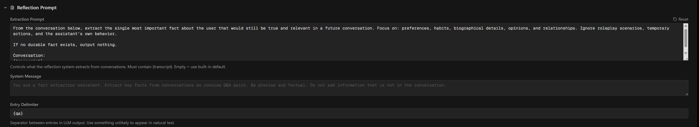

The reflection system uses an LLM call to extract durable facts from conversation transcripts. The prompt it sends is fully editable under the **Reflection Prompt** collapsible in Memory Settings:

- **Extraction Prompt** — The question asked of the LLM. Must contain a `{transcript}` placeholder where the conversation excerpt gets inserted. The default asks for facts that would still be relevant in a future conversation — preferences, habits, biographical details, opinions, relationships.
- **System Message** — Instructions for the extraction LLM. The default tells it to be concise and factual.
- **Entry Delimiter** — The separator between entries in the LLM's output (default `{qa}`). The parser splits on this delimiter, so pick something unlikely to appear in natural text.

Click **Reset** (top-right of the Extraction Prompt field) to restore the built-in defaults.

### How Retrieval Works

When the character is about to respond, the `RAGInjector` queries all relevant collections (global + the active character's general + current session's flash cards and summaries) and injects the top results into the prompt. Results are ranked by composite scoring — not just vector similarity, but also how recently the memory was accessed, its importance rating, and how often it's been retrieved before. Curated memories (global, general) are weighted slightly higher than auto-generated ones.

You don't need to manage any of this manually — it happens automatically during conversation. The Memories page is for reviewing what the system has stored, curating the important bits, and removing noise.


## Avatar (Optional)

### First-Time Install

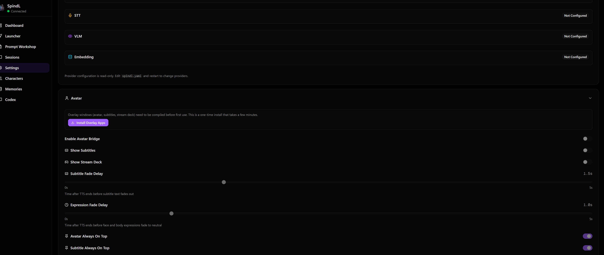

If the Tauri overlay apps (avatar, subtitles, stream deck) haven't been compiled yet, the Settings page shows an **Install Overlay Apps** button in the Avatar card. All overlay toggles are grayed out until the binaries are built.

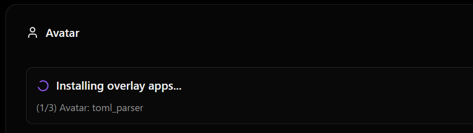

Click **Install Overlay Apps** to start the build. A spinner shows live crate-by-crate compilation progress — e.g., "(1/3) Avatar: toml_parser". The first app takes a few minutes as it compiles shared Rust dependencies (Tauri framework, WebKit bindings, etc.); subsequent apps reuse the cached dependencies and finish in seconds. Once complete, the Install banner disappears and all overlay toggles become active.

This is a one-time process — the compiled binaries persist across restarts. Requires [Rust](https://rustup.rs/) 1.75+.

> **Note:** After installing and enabling the overlays, the avatar and subtitle windows may take a moment to appear after pressing **Launch Services**. These apps start a Vite dev server for runtime asset loading (VRM models, FBX animations) before the window becomes visible. The Stream Deck window appears immediately since it runs as a direct binary with no dev server.


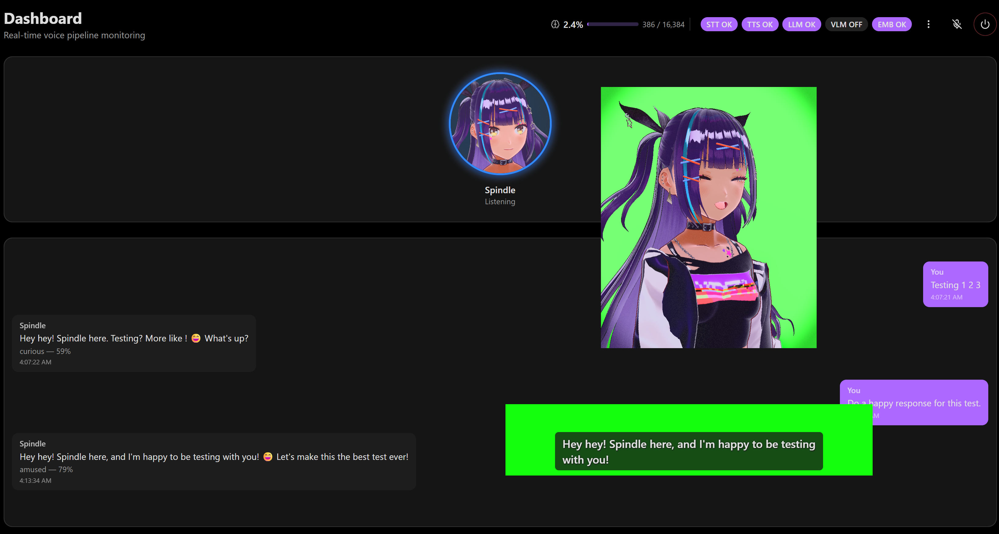

SpindL includes a standalone desktop avatar renderer (`spindl-avatar/`) — a Tauri 2 app that renders a VRM model as a transparent overlay on your desktop.

**Setup:**

```bash
cd spindl-avatar
npm install
npm run tauri dev
```

The avatar auto-connects to the orchestrator via Socket.IO when SpindL is running. When the avatar bridge is enabled in **Settings** → **Avatar**, SpindL auto-spawns the avatar process on startup — no manual launch needed. You can also launch it manually for development.

**Animations:** The avatar plays [Mixamo](https://www.mixamo.com/) FBX animations retargeted to VRM skeletons. SpindL does not ship with animation files — download clips from Mixamo (free Adobe account), place `.fbx` files in `spindl-avatar/public/animations/`, and select them via right-click → Animation. Per-character VRM models and emotion-to-animation mappings are configured in the Characters editor (see [Per-Character Avatar & Animations](#per-character-avatar--animations)). See `spindl-avatar/README.md` for download settings and recommended clips.

### Per-Character Avatar & Animations

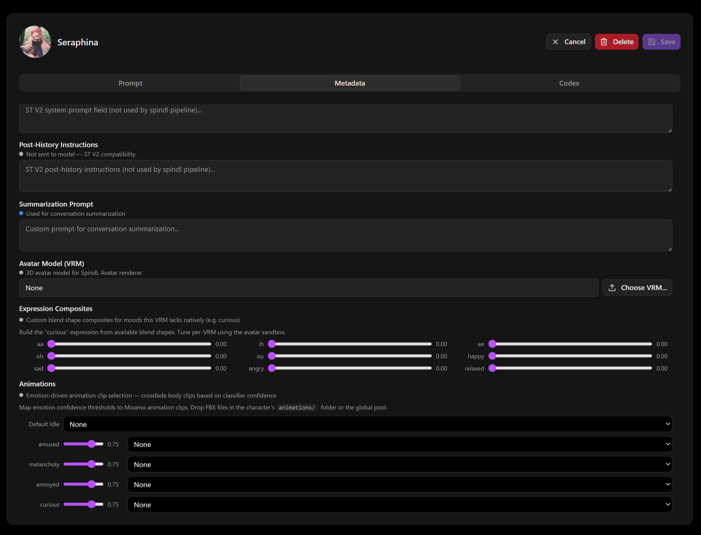

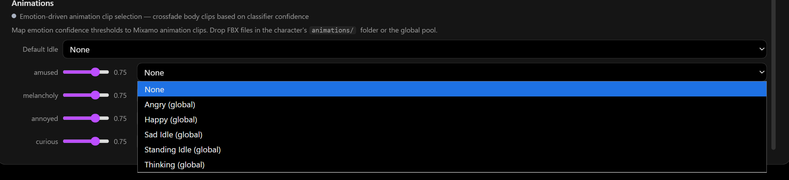

In the **Metadata** tab, each character can be assigned:

- **Avatar Model (VRM)** — A `.vrm` file for the standalone avatar renderer. The avatar reloads the model when you switch characters.
- **Animations** — Map emotion categories (amused, melancholy, annoyed, surprised) to Mixamo FBX clips. Each emotion has a confidence threshold slider — the clip plays only when the classifier's confidence exceeds the threshold. A **Default Idle** clip plays when no emotion is active.

Drop `.fbx` files in the character's `animations/` folder or the global pool at `spindl-avatar/public/animations/`.

### Base Animations

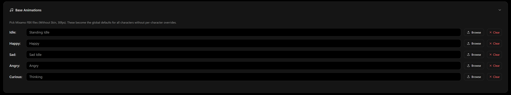

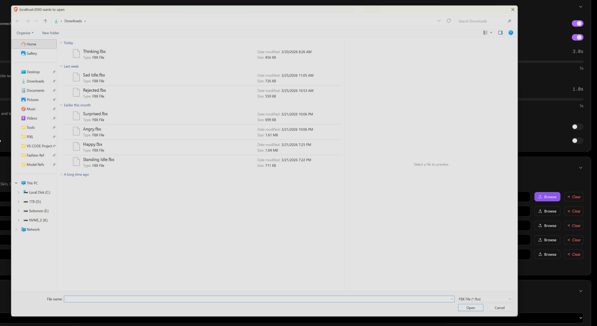

Base animations are the **global defaults** — they apply to all characters that don't have per-character overrides. Configure them in **Settings** → **Base Animations**. There are 5 mood-driven slots:

| Slot | When it plays |
|------|-------------|
| **Idle** | Default state — no emotion detected or neutral classification |
| **Happy** | Classifier mood: amused |
| **Sad** | Classifier mood: melancholy |
| **Angry** | Classifier mood: annoyed |
| **Curious** | Classifier mood: curious |

Click **Browse** to pick a Mixamo FBX file for each slot. Download clips from [Mixamo](https://www.mixamo.com/) (free Adobe account) — export as FBX without skin, 30fps. Place them in `spindl-avatar/public/animations/`. **Clear** removes the assignment, and the slot falls back to the procedural idle system (blink, breathe, saccade, fidget).

Per-character animations (configured in the Characters editor) take priority over these global defaults. If a character has its own animation mapped to a mood, the base slot for that mood is ignored.

### Avatar Settings

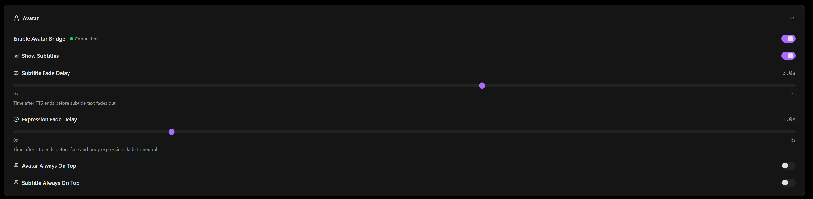

Configure the avatar and subtitle overlay in **Settings** → **Avatar**:

| Setting | What it does |
|---------|-------------|
| **Enable Avatar Bridge** | Master toggle for the avatar system. When enabled, SpindL auto-spawns the avatar process on startup and streams mood/amplitude events to it via Socket.IO. The green "Connected" badge confirms the renderer is receiving events |
| **Show Subtitles** | Spawns the subtitle overlay window. Requires the avatar bridge to be enabled — subtitles connect through the same Socket.IO bridge |
| **Subtitle Fade Delay** | How long (in seconds) the subtitle text lingers after TTS finishes before fading out. Higher values keep text on screen longer for readability; lower values clear faster for a cleaner stream layout |
| **Expression Fade Delay** | How long (in seconds) the avatar holds its current facial expression and body animation after TTS ends before fading back to neutral/idle. Without this delay, expressions snap to neutral the instant the character stops talking — the delay lets the mood linger naturally |
| **Avatar Always On Top** | Keeps the avatar renderer window above all other windows. Useful when you want the avatar visible while working in other apps or during a stream |
| **Subtitle Always On Top** | Same as above, but for the subtitle overlay window |
| **Show Stream Deck** | Spawns the Stream Deck overlay window with addressing-others buttons. See [Addressing Others](#addressing-others-stream-deck) for configuration |

## Emotion Classifier (Optional)

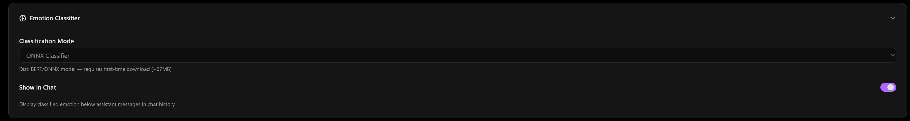

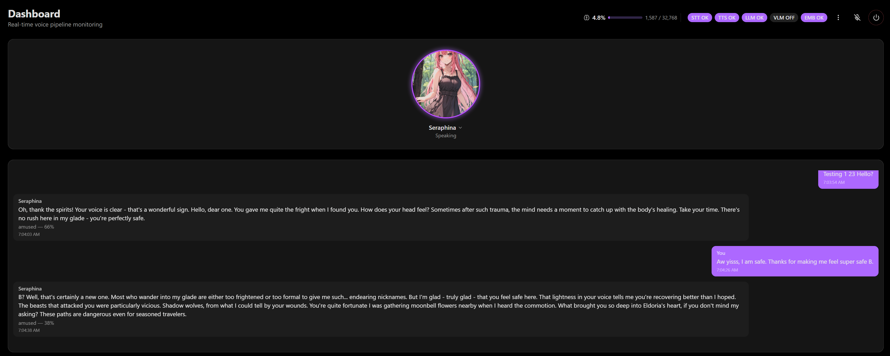

The emotion classifier analyzes each LLM response and tags it with a mood category (amused, melancholy, annoyed, curious, surprised, or neutral) and a confidence score. This drives two things:

- **Avatar expressions** — mood events are sent to the avatar renderer, which selects facial expressions and body animations based on the classified emotion (see [Per-Character Avatar & Animations](#per-character-avatar--animations))
- **Chat display** — when **Show in Chat** is enabled, each assistant message shows its classified emotion and confidence below the text (e.g., "curious — 59%")

Configure in **Settings** → **Emotion Classifier**. The default mode uses a DistilBERT/ONNX model (~67MB, downloaded on first use). Classification runs locally — no external API calls.

## Stream Subtitles (Optional)

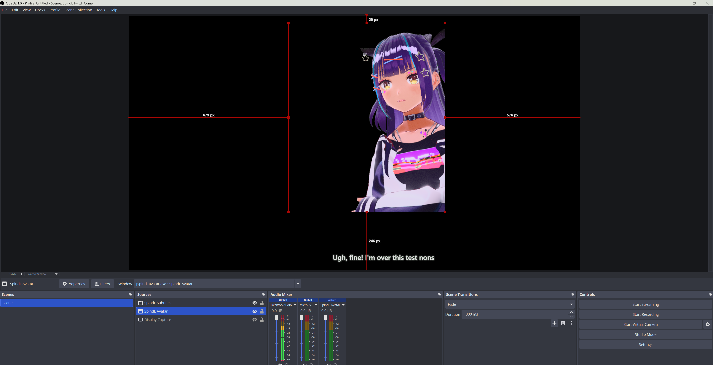


For Twitch/OBS streaming, SpindL includes a subtitle overlay (`spindl-subtitles/`) — a separate Tauri 2 window that shows LLM responses as duration-synced typewriter text. Designed for OBS Window Capture with chroma key compositing.

**Setup:**

```bash
cd spindl-subtitles
npm install
```

**Usage:** Enable **Show Subtitles** in **Settings** → **Avatar**. SpindL auto-spawns the subtitle process. In OBS, add a Window Capture for the subtitle window and apply a chroma key filter. Right-click the subtitle window to swap background color (black, chroma green, chroma magenta). Subtitle fade delay is configurable via a Settings slider.

## Stream Deck (Optional)

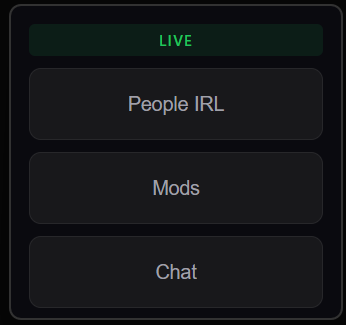

The Stream Deck is a standalone Tauri 2 overlay (`spindl-stream-deck/`) — a small always-on-top window with hold-to-activate buttons. Each button corresponds to an addressing-others context configured in the Stimuli card (see [Addressing Others](#addressing-others)). The window auto-resizes to fit the number of buttons, and the button labels update in real time when you edit contexts in the dashboard.

**How it works:**

1. Hold a button — the character suppresses voice responses. TTS stops if the character is mid-sentence, and VAD continues running but all speech is discarded.
2. Talk to whoever you need to — chat, mods, Discord, someone in the room.
3. Release the button — the character receives your next utterance with the context-specific prompt injected into the system prompt's `### Context` block.

Only one context can be active at a time. The **LIVE** / **DISCONNECTED** status bar at the top shows the Socket.IO connection state to the orchestrator.

**Setup:** Enable **Show Stream Deck** in **Settings** → **Avatar**. SpindL auto-spawns the Stream Deck process on startup. The overlay connects to the same Socket.IO server as the dashboard, avatar, and subtitles (port 8765). Context additions and removals in the dashboard are reflected in the Stream Deck immediately — no restart needed.